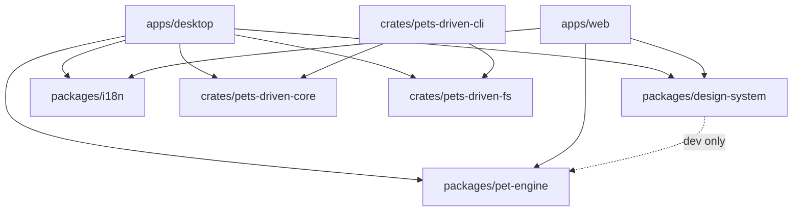

# AGENTS.md

Pets-Driven is a Windows desktop app (Tauri + React) where a pet represents one bound coding-agent execution, plus the landing site and shared packages around it. Start with `CONTEXT.md` for the domain language and `ARCHITECTURE.md` for how the modules connect.

## Language

- All code comments, JSDoc, and in-repo documentation (Markdown, ADRs, READMEs) must be written in English.
- Git commit messages and pull request descriptions must also be written in English.
- This applies to source files, type definitions, test descriptions, and any docs committed to the repository.
- Conversations and chat with the user may continue in Korean; only artifacts written to disk or git history are English-only.

## Commands

```bash
pnpm dev              # desktop app (Tauri)
pnpm dev:playground   # simulation playground in the browser
pnpm dev:design       # design-system component gallery
pnpm test             # every package's suite + scripts/*.test.mjs
pnpm typecheck        # tsc across the workspace
pnpm check            # biome lint + format check
pnpm sync-pets        # copy repo-root pets/ into each app's public assets
pnpm test:e2e         # Playwright, desktop only
pnpm test:path-hook    # the installer's PATH edit, against a scratch registry key
```

## Modules

| Path | What it owns | Docs |
| --- | --- | --- |
| `apps/desktop` | Tauri shell, pet windows, agent event ingress | `apps/desktop/AGENTS.md` |
| `crates/pets-driven-core` | Authoritative Pet + Registered Working Directory state behind a repository seam | `crates/AGENTS.md` |
| `crates/pets-driven-fs` | Shared on-disk `state.v1.json` repository with a cross-process file lock | `crates/AGENTS.md` |
| `crates/pets-driven-protocol` | Hook-forwarding wire contract (routes, synthesized event) | `crates/AGENTS.md` |
| `crates/pets-driven-cli` | The `pdd` CLI: direct state ops + live hook forwarding | `crates/AGENTS.md` |
| `apps/web` | Landing site + Remotion demo video | `apps/web/AGENTS.md` |
| `packages/pet-engine` | ECS simulation, personalities, sprite state | `packages/pet-engine/AGENTS.md` |
| `packages/design-system` | Tokens and shared React components | `packages/design-system/AGENTS.md` |
| `packages/i18n` | Locales, i18next setup, translation catalog | `packages/i18n/AGENTS.md` |
| `plugins/pets-driven` | Shared Claude Code + Codex plugin: hooks, commands, skills | — |
| `pets/` | Canonical built-in pet definitions and spritesheets | `pets/README.md` |
| `scripts/` | Asset sync, version bump, install test | — |



`pet-engine` depends on nothing in the workspace and must stay that way. Full graph, runtime event flow, and a ripple table: `ARCHITECTURE.md`.

The Rust side is a Cargo workspace (root `Cargo.toml`): the desktop Tauri crate plus `crates/pets-driven-core` (persisted Pet + Registered Working Directory behavior behind a `StateRepository` seam; depends only on `serde`, `serde_json`, `thiserror`), `crates/pets-driven-fs` (the shared `FileStateRepository` — the on-disk `state.v1.json` plus an `fslock` cross-process lock), `crates/pets-driven-protocol` (the hook-forwarding wire contract), and `crates/pets-driven-cli` (the `pdd` binary).

**The desktop and the `pdd` CLI both write state directly** through the core over the *same* `pets-driven-fs` repository — the same file, resolved identically (`dirs::data_dir()/com.petsdriven.desktop/state.v1.json`, overridable with `PETS_DRIVEN_STATE_PATH`), and serialised by the same cross-process lock. So `pdd` works whether or not the desktop is running and cannot race it. A write is a durable state change; a *hook event* is not — it is a transient signal a running pet reacts to, so `pdd forward` goes to the live app over the loopback ingress and no-ops when the app is down. The desktop watches the state file and reloads the webview when the CLI writes it.

## Non-obvious rules

- **Gotcha: `pets/` at the repo root is the source of truth for built-in pets.** `pnpm sync-pets` copies it into each app's git-ignored public assets directory. Editing the copied output looks like it works until the next sync silently reverts it.
- **Note: the pet window is a fixed 192x268 always-on-top overlay.** The OS window never shrinks, so the projection must center that fixed window rather than the scaled sprite frame — otherwise small pets sink and the collision capsule clips.
- **Why the engine is a separate package:** the simulation must stay deterministic and headless so it can be tested without a window. Keep `Math.random()`, `Date.now()`, and DOM access out of it.
- **Don't add a system without registering it** in the pet-engine phase pipeline (`packages/pet-engine/src/core/phases.ts`); an unregistered system silently never runs.
- **Caveat: `pnpm test` is the full workspace suite and is slow.** For a change scoped to one package, run that package's own suite with `pnpm --filter <pkg> test`. A pure token hex edit needs neither the desktop suite nor a typecheck.

## Conventions

- Each module keeps its context in its own `AGENTS.md`, with a one-line `CLAUDE.md` beside it that reads `See [AGENTS.md](./AGENTS.md).` — content lives in exactly one file.
- Every cross-package import goes through the target package's declared `exports` entry (`@pets-driven/<pkg>/...`), never a deep relative path across a package boundary.
