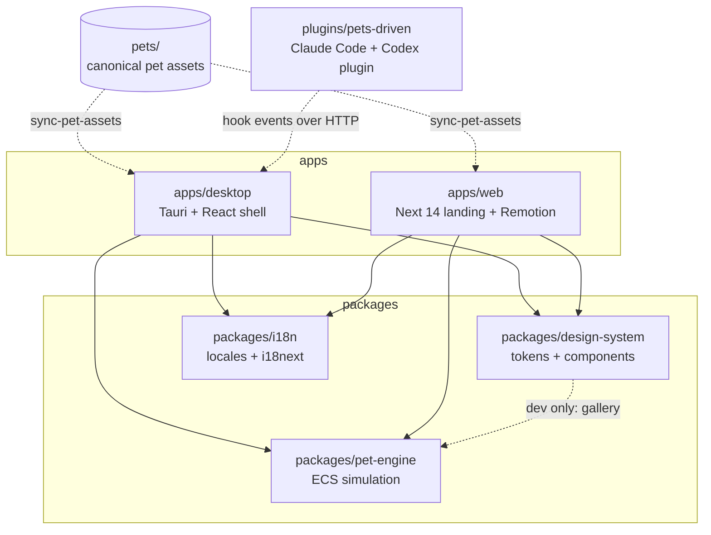
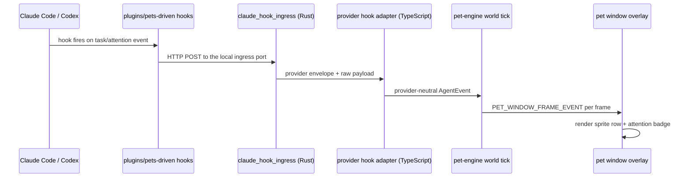

# Architecture

How the workspace fits together: which package depends on which, and how an agent event becomes a pet reaction on screen. Terminology (Pet, Agent Source, Attention Hold) is defined in `CONTEXT.md`.

## Package graph

Solid edges are `workspace:*` runtime dependencies declared in each `package.json`. Dashed edges are build-time or runtime wiring that no import graph shows.

**The graph has no cycles and must stay that way.** `pet-engine` depends on nothing in the workspace — it is the leaf every other package builds on, so simulation logic never reaches back into an app. `design-system` lists `pet-engine` as a *dev* dependency only, for its gallery under `dev/`; shipping code in `design-system` must not import the engine.

## Runtime flow: agent event to pet reaction

Anchors for each hop: `plugins/pets-driven/hooks/`, `apps/desktop/src-tauri/src/claude_hook_ingress.rs`, the provider adapters under `apps/desktop/src/adapters/agent-events/`, `packages/pet-engine`, `apps/desktop/src-tauri/src/pet_windows.rs`, and the frontend transport in `apps/desktop/src/pet-window/pet-window-transport.ts`. Hook events are transient signals; durable pet and working-directory writes use `pets-driven-core` over the shared `pets-driven-fs` repository.

**The pet window owns no simulation state.** It is a separate always-on-top overlay driven entirely by frame events from the main window, so a bug in what a pet *shows* is a projection bug, not a simulation bug — see `apps/desktop/src/pet-window/pet-window-projection.ts` before touching engine code.

## Where a change ripples

| Change | Also touch |
| --- | --- |
| Color or token value | `packages/design-system` — `src/tokens/colors.css` **and** its `colors.ts` mirror (a test enforces the pair) |
| New pet or spritesheet | repo-root `pets/`, then re-run `pnpm sync-pets`; never edit the generated `public/codex-pets` copies |
| New simulation system | `packages/pet-engine` — register it in `src/core/phases.ts` or it never runs |
| New user-facing string | `packages/i18n` — English bundle first, then the Korean one |
| New agent hook event | `plugins/pets-driven/hooks/`, the Rust ingress, and the desktop adapter under `apps/desktop/src/adapters/agent-events/` |

## Module docs

- `apps/desktop/AGENTS.md`
- `apps/web/AGENTS.md`
- `packages/pet-engine/AGENTS.md`
- `packages/design-system/AGENTS.md`
- `packages/i18n/AGENTS.md`
