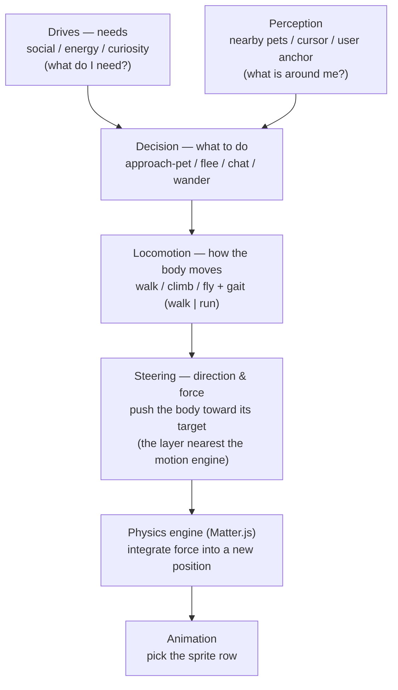
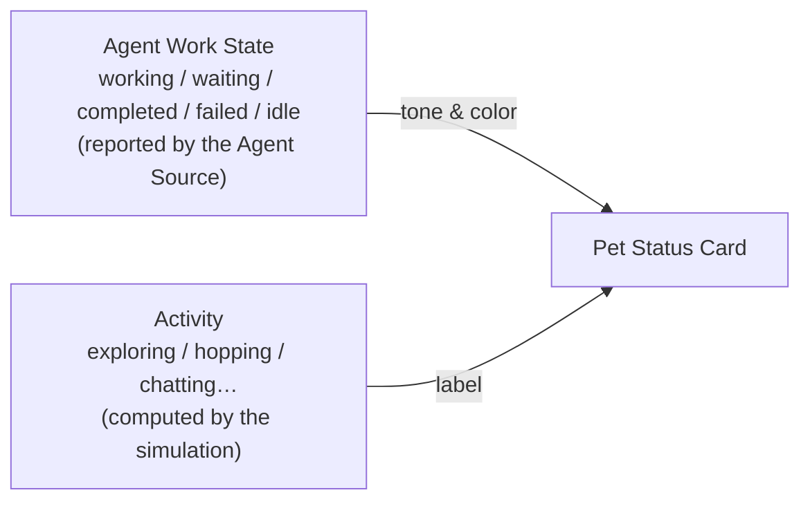
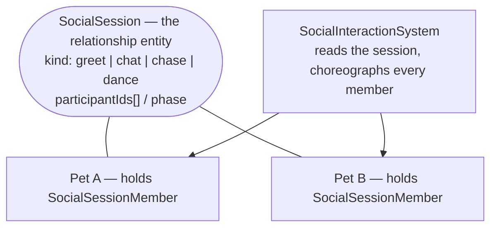

# Pets-Driven

Pets-Driven is a development companion context where visible pets represent agent work without collapsing user-facing personality into terminal execution details.

## Language

**Pet**:
A user-facing companion that represents exactly one bound agent execution subject.
_Avoid_: agent, terminal

**Agent Source**:
An execution subject that emits task and attention events for a bound **Pet**.
_Avoid_: pet, process

**Terminal Channel**:
The single user-facing terminal connection between a **Pet** and its active **Agent Source**.
_Avoid_: session

**Agent Event Feed**:
The hook-driven event stream that lets a **Pet** express work state for its **Working Directory**.
_Avoid_: terminal channel

**Attention Hold**:
A user-acknowledged state where a **Pet** stops moving and shows an attention badge or ring after an event.
_Avoid_: terminal focus, notification only

**Attention-Producing Event**:
An **Agent Event Feed** event that must become an **Attention Hold**.
_Avoid_: task started, activity ping

**Attention History**:
The short-lived recent sequence of **Attention-Producing Events** for a **Pet**.
_Avoid_: current badge, durable audit log

**Review Hold**:
An **Attention Hold** created by a completed task that still requires the user to notice the result.
_Avoid_: idle completion

**External Terminal Channel**:
A **Terminal Channel** that is owned by a terminal outside the pets-driven app.
_Avoid_: unmanaged terminal

**Attach**:
The act of registering a terminal as the active **Terminal Channel** for a **Working Directory**.
_Avoid_: detect, auto-bind

**Attach Command**:
A command run inside an external terminal to attach it to the **Pet** for the current **Working Directory**.
_Avoid_: automatic terminal discovery

**Hook Bridge**:
The command or adapter that forwards agent hook events to pets-driven with their **Working Directory** context.
_Avoid_: trusted provider session identity

**Hook Setup**:
The service setting that installs or configures a **Hook Bridge** for agent event forwarding.
_Avoid_: attach side effect

**Workspace**:
A saved collection of explicitly chosen **Working Directories** that pets-driven manages together.
_Avoid_: parent folder, discovered project tree

**Working Directory**:
The filesystem directory that acts as the identity boundary for one **Pet**.
_Avoid_: cwd, folder

**Registered Working Directory**:
A **Working Directory** that the user has explicitly chosen for pets-driven management.
_Avoid_: discovered directory, child workspace

**Working Directory Creation**:
The user-initiated creation of a new **Working Directory** before registration.
_Avoid_: scaffold, clone

**Pet Birth**:
The moment a **Working Directory** becomes registered and its **Pet** starts existing.
_Avoid_: setup completion, agent creation

**Root Project**:
An optional reference or grouping label for related **Registered Working Directories**.
_Avoid_: execution boundary, permission boundary

**Execution Environment**:
A saved runtime boundary for a **Pet**, rooted in one **Registered Working Directory**.
_Avoid_: terminal, shell

**Launch Configuration**:
The command and terminal details used to start an **Agent Source** from an **Execution Environment**.
_Avoid_: execution environment

**Launch Readiness**:
Whether a **Pet** has enough saved launch information to open a **Terminal Channel**.
_Avoid_: configured, enabled

**Pet Profile**:
The personality, speech behavior, and visual asset settings for a **Pet**.
_Avoid_: character, config

**Pet Asset**:
The installed visual package and description chosen for a **Pet** at birth.
_Avoid_: sprite only, decoration

**Partner Asset Service**:
An external service that creates and installs **Pet Assets** for pets-driven to use.
_Avoid_: pets-driven asset generator

**Personality Catalog**:
The service-owned list of supported personality presets and tunable traits.
_Avoid_: asset personality, generated personality

**Skill-Assisted Personality Setup**:
An optional workflow where an agent skill helps map a **Pet Asset** description to entries in the **Personality Catalog**.
_Avoid_: automatic personality decision

**Pet Archive**:
A reversible state where a **Pet** is hidden and inactive without deleting its **Working Directory**.
_Avoid_: delete, uninstall

**Pet Visibility**:
A screen-level preference for whether a non-archived **Pet** is currently shown.
_Avoid_: archive, active state

**Pet Surface**:
The collection of desktop overlay windows where visible **Pets** live above the user's desktop.
_Avoid_: dashboard, playground page

**Pet Window**:
An individual desktop overlay window that hosts one visible **Pet**.
_Avoid_: full-screen overlay, dashboard window

**Pet Hit Region**:
The non-transparent pet and overlay pixels of a **Pet Window** that can receive pointer input.
_Avoid_: window rectangle, transparent margin

**Simulation World**:
The single logical space that holds every visible **Pet**'s position and computes their motion and contact, regardless of how many **Pet Windows** or monitors exist.
_Avoid_: Pet Surface, monitor, screen

**Simulation Host**:
The single authority that runs the **Simulation World** and publishes each **Pet World Position** to the **Pet Windows**.
_Avoid_: per-window simulation, peer pets

**World Coordinate Space**:
The continuous coordinate plane of the **Simulation World**, spanning the entire virtual desktop across all monitors as one surface.
_Avoid_: per-monitor space, window-local space

**Pet World Position**:
A **Pet**'s location within the **World Coordinate Space**, which its **Pet Window** is projected onto the screen to follow.
_Avoid_: window position, screen coordinate

**Walkable Region**:
The union of monitor work areas within the **World Coordinate Space** that a **Pet** may occupy; areas covered by no monitor act as boundaries.
_Avoid_: bounding rectangle, full virtual-desktop rectangle

**Screen Floor**:
The bottom of each monitor's work area, above the taskbar, that a **Pet** stands and rests on under gravity.
_Avoid_: OS window edge, taskbar surface

**Management Surface**:
The service UI used for registration, settings, assets, personalities, hooks, archive, and history.
_Avoid_: pet habitat

**Direct Manipulation**:
Primary pointer interaction with a **Pet** body, used for drag-and-drop play.
_Avoid_: open terminal, open context

**Petting**:
A stroking gesture — the cursor oscillating horizontally over a **Pet** body — that comforts the **Pet** and is the only interaction that acknowledges an agent task report.
_Avoid_: hover, click, press

**Pet Context Menu**:
The secondary-click menu for commands and settings related to a **Pet**.
_Avoid_: left-click panel

**Pet Overlay Menu**:
The secondary-click menu for presentation controls on a specific **Pet Overlay Action**.
_Avoid_: Pet Context Menu

**Pet Overlay Action**:
A clickable UI affordance attached to a **Pet**, such as a speech bubble or attention badge.
_Avoid_: pet body click

**Attention Overlay**:
A **Pet Overlay Action** that represents an active **Attention Hold**.
_Avoid_: speech bubble, emotion bubble

**Acknowledge Feedback**:
A short personality-aware reaction shown after the user acknowledges an **Attention Hold**.
_Avoid_: persistent state, archive

**Instruction File**:
The optional per-pet `AGENTS.md` that defines working instructions for the bound **Agent Source** when present.
_Avoid_: prompt, system prompt

**Agent Work State**:
The task status an **Agent Source** reports for a **Pet** — one of working, waiting, completed, failed, or idle. One of the two axes of what a **Pet** presents.
_Avoid_: status (bare), behavior, activity

**Activity**:
What a **Pet** is autonomously doing in the **Simulation World** right now (for example exploring, hopping, chatting), computed by the simulation. The second, independent axis, separate from **Agent Work State**.
_Avoid_: behavior, status, intent

**Working Style**:
How a **Pet** occupies itself while its **Agent Work State** is working — the pose its **Personality Catalog** entry holds (heads down, tinkering, mulling over, fussing over, taking it easy) and how often it breaks off to pace. It is what a working **Pet** reports as its **Activity**.
_Avoid_: agent work state, signature activity, idle

**Pet Status Card**:
A card presentation of a **Pet** that combines its **Agent Work State** (as tone and color) and its **Activity** (as label) into a single chip. Presentation only, not a domain concept.
_Avoid_: status, pet state

**Decision**:
The behavior a **Pet** picks to start this moment (for example wander-far, flee-from-pet, chase-cursor), chosen from ranked candidates and tagged with the source that won priority. Short-lived; the internal choice layer beneath **Activity**.
_Avoid_: behavior (bare), intent, activity

**Decision Source**:
Which kind of trigger a **Decision** came from, used to rank competing decisions: user-interaction, agent-event, social, collision, or autonomous (in priority order, highest first).
_Avoid_: behavior priority (as a domain term)

**Mood**:
The short-lived emotional context that colors a **Pet**'s next decisions along valence, arousal, and confidence. **Mood** changes after meaningful experiences and gradually returns toward the temperament implied by the **Pet Profile**.
_Avoid_: personality, drive, expression

**Recent Experience Memory**:
The bounded, session-local list of recent events that are still shaping a **Pet**'s **Mood**, such as being petted, startled, acknowledged, completing work, or finishing a **Social Session**. It is behavioral context, not durable history or a lasting relationship.
_Avoid_: Attention History, relationship, audit log

**Locomotion**:
How a **Pet**'s body moves: its means (walking, climbing, flying) and its gait (an easy amble versus a full-tilt run). Chosen from the **Decision** each frame, before **Steering**, and it gates which **Steering** force may apply (a walking body gets a walking push, a flying body gets a steering push).
_Avoid_: steering, intent, motion mode

**Steering**:
Given a **Pet**'s **Locomotion**, the direction-and-force step that pushes the body toward its motion target and hands the result to the physics engine — the layer nearest the motion engine. Its mode is stand, pursue a target, or ease to a stop by the user. Replaces the retired "intent" (idle/active/seek).
_Avoid_: intent, decision, locomotion

**Social Session**:
A single, transient pet-to-pet interaction that a small set of **Pets** share until it ends. It is spawned as its own entity that owns the shared clock, not a lasting bond between the members. Two **Pets** is the base case; during play nearby idle **Pets** may join, growing it into a small group capped at four so it stays readable.
_Avoid_: session (bare), relationship, friendship

**Social Session Kind**:
What the **Pets** are doing together in a **Social Session**: greet (a quick hello), chat (alternating speech bubbles), chase (taking turns as chaser and runner), or dance (non-crossing, beat-synchronized spatial choreography).
_Avoid_: phase, activity

**Social Session Phase**:
How a **Social Session** progresses over its life: approach (walk together and close the gap), then play (the kind-specific interaction), then part (a short wind-down before teardown).
_Avoid_: kind

**Social Invite**:
A transient offer one **Pet** places on another to start a **Social Session**; the target accepts or declines it, and it lapses if unanswered.
_Avoid_: request, session

**Afterglow**:
The short contented beat right after a **Social Session** ends, during which a **Pet** lingers in place instead of snapping straight back to wandering and cannot be invited again — a social refractory period.
_Avoid_: cooldown (as a domain term), session

**Signature Reaction**:
A brief, one-sided social response made by a nearby idle **Pet** when it notices another **Pet** performing one of its personality-signature **Activities**. The responder may join in, cheer, watch, or keep its distance according to its own **Pet Profile**. It does not interrupt the source **Pet** or create a **Social Session**.
_Avoid_: Social Session, relationship, copied personality

## Relationships

- A **Pet** is bound to exactly one **Working Directory**.
- A **Working Directory** has exactly one **Pet**.
- A **Pet** represents events from the **Agent Event Feed** for its **Working Directory**.
- A **Working Directory** has at most one active **Agent Source**.
- A **Pet** has at most one active **Terminal Channel**.
- A **Terminal Channel** belongs to exactly one **Working Directory**.
- A **Terminal Channel** is optional and is not required for a **Pet** to express hook events.
- An **Agent Event Feed** belongs to exactly one **Working Directory**.
- **Attention Hold** is created by **Attention-Producing Events**.
- `task.waiting`, `attention.requested`, `task.failed`, and `task.completed` are **Attention-Producing Events**.
- `task.started` is not an **Attention-Producing Event**.
- A **Pet** displays the latest **Attention-Producing Event** as its current **Attention Hold**.
- **Attention History** belongs to a **Pet** but is not durable long-term data.
- In the MVP, **Attention History** is session-local recent context and is not persisted across app restarts.
- In the MVP, **Attention History** keeps up to five recent events per **Pet**.
- Replaced **Attention-Producing Events** remain available through **Attention History**.
- **Attention History** is accessed through the **Pet Context Menu** or **Management Surface**, not stacked on the **Pet Surface**.
- Acknowledging **Attention Hold** does not remove events from **Attention History**.
- **Attention Hold** remains until the user acknowledges it by **Petting** the **Pet**.
- **Direct Manipulation** (press, drag, throw) does not acknowledge **Attention Hold**; only **Petting** releases it.
- **Petting** also clears a live working report, returning the **Pet** to idle.
- Clicking an **Attention Overlay** does not acknowledge its **Attention Hold**.
- Clicking non-attention overlays changes presentation only and does not acknowledge **Attention Hold**.
- Acknowledging **Attention Hold** releases the hold and may start **Acknowledge Feedback**.
- **Acknowledge Feedback** may vary by event kind, **Pet Profile**, and current presentation state.
- **Acknowledge Feedback** also varies by the gesture that acknowledged the hold: **Petting** is the affectionate one and answers with a heart, while a double-click is a dismissal and answers with its own beat, so the two never read as the same reaction.
- **Acknowledge Feedback** is owned by the **Simulation World**, not by the **Pet Window** presentation layer alone.
- **Acknowledge Feedback** is caused by `user-interaction` behavior priority.
- A new **Attention-Producing Event** interrupts **Acknowledge Feedback** and creates a new **Attention Hold**.
- Minimizing a **Pet Overlay Action** changes presentation only and does not acknowledge **Attention Hold**.
- A minimized **Pet Overlay Action** keeps a visible compact indicator; its exact UI is undecided.
- A completed task creates a **Review Hold** instead of automatically returning to idle.
- A **Terminal Channel** may be owned by the pets-driven app or by an external terminal.
- An **External Terminal Channel** becomes active only through **Attach**.
- **Attach** is initiated by running an **Attach Command** from the external terminal.
- An **Attach Command** from an unregistered **Working Directory** is ignored, does not create a **Pet**, and only reports that status in debug or verbose mode.
- When multiple **Attach Commands** target the same **Working Directory**, the last attach wins.
- A **Hook Bridge** identifies the relevant **Pet** by sending the event's **Working Directory** to pets-driven.
- pets-driven resolves hook events through the current **Working Directory** to **Pet** mapping instead of trusting provider session ids.
- **Hook Setup** is managed from service settings and is separate from **Attach**.
- In the MVP, **Hook Setup** is global and there is no per-directory hook enable or disable.
- An **Agent Source** belongs to exactly one **Execution Environment**.
- A **Workspace** contains one or more **Registered Working Directories**.
- A **Registered Working Directory** is created by choosing an existing **Working Directory** or by **Working Directory Creation**.
- **Pet Birth** happens immediately when a **Working Directory** becomes a **Registered Working Directory**.
- **Pet Birth** includes choosing one installed **Pet Asset**.
- pets-driven references **Pet Assets** in place and does not copy asset files into a **Working Directory**.
- **Pet Birth** assigns a default **Personality Catalog** entry that the user may change later.
- A **Registered Working Directory** has exactly one **Execution Environment**.
- An **Execution Environment** has exactly one **Pet**.
- An **Execution Environment** may have one **Launch Configuration**.
- A **Pet** has **Launch Readiness** independent from whether it has an active **Terminal Channel**.
- A **Pet** exists and can be interacted with even when it has no **Launch Configuration**.
- A **Registered Working Directory** may reference one **Root Project**.
- A **Pet** has exactly one **Pet Profile**.
- A **Pet Profile** is selected from the **Personality Catalog** and can be adjusted by the user.
- **Skill-Assisted Personality Setup** may suggest **Personality Catalog** settings but does not decide them for the service.
- **Pet Archive** preserves the **Registered Working Directory**, **Pet Profile**, **Pet Asset** reference, and **Launch Configuration**.
- **Pet Archive** may discard **Attention History**.
- **Pet Visibility** does not change **Pet Archive**, **Terminal Channel**, or **Agent Source** state.
- Visible **Pets** live in individual **Pet Windows** on the **Pet Surface**, while setup and settings live on the **Management Surface**.
- A **Pet Window** belongs to exactly one visible **Pet**.
- A **Pet Window** only receives pointer input through its **Pet Hit Region**.
- A **Pet Hit Region** includes visible **Pet Overlay Action** pixels as well as the **Pet** body.
- Transparent pixels in a **Pet Window** pass through to the desktop behind it.
- **Direct Manipulation** starts only from the **Pet** body portion of the **Pet Hit Region**, not from **Pet Overlay Action** pixels.
- Secondary-click on the **Pet** body opens the **Pet Context Menu**.
- Secondary-click on a **Pet Overlay Action** opens the **Pet Overlay Menu** for presentation controls such as minimize.
- A **Pet Window** grows only while a **Pet Overlay Action** is shown and otherwise stays sized to its **Pet**.
- There is exactly one **Simulation World** shared by all visible **Pets**.
- The **Simulation World** runs in exactly one **Simulation Host**, which publishes each **Pet World Position**; a **Pet Window** renders its **Pet** from those positions and does not run its own simulation.
- During **Direct Manipulation**, a **Pet Window** forwards pointer position to the **Simulation Host**, which moves the **Pet** to follow the cursor and restores gravity when the user releases.
- The **Simulation World** uses one **World Coordinate Space** that spans the whole virtual desktop as a single continuous plane.
- Each visible **Pet** has a **Pet World Position** in the **World Coordinate Space**.
- A **Pet Window** follows its **Pet** by projecting the **Pet World Position** onto virtual-desktop screen coordinates.
- **Pets** approach, contact, and react to each other within the single **Simulation World**, regardless of which monitor their **Pet Windows** appear on.
- **Pet** contact is computed only in the **Simulation World**; **Pet Windows** are OS windows and do not physically collide.
- **Pets** do not physically block each other in the **Simulation World**: they pass through freely, and overlap is only a contact signal that can trigger a reaction, never a force that pushes them apart. (Solid pet bodies were removed because the separation forces they required produced grinding and trembling in clusters.)
- Two idle **Pets** that come to rest on the same spot take one small step aside to keep a little personal space — a low-priority autonomous **Decision** (`make-room`) that sets a motion target, purely cosmetic, distinct from any collision reaction.
- A **Pet World Position** is constrained to the **Walkable Region** so every **Pet Window** stays on a visible monitor.
- Regions of the **World Coordinate Space** covered by no monitor act as boundaries a **Pet** cannot enter.
- In the single-monitor MVP, the **Walkable Region** equals that monitor's work area, so no union computation is required.
- A **Pet** is subject to gravity and rests on the **Screen Floor** within the **Walkable Region**.
- The only surfaces in the MVP are screen edges; a **Pet** does not stand on real OS application windows.
- On multiple monitors the **Screen Floor** is stepped, with one floor per monitor work area.
- **Direct Manipulation** is separate from **Pet Context Menu** and **Pet Overlay Action**.
- **Terminal Channel** commands are reached through **Pet Context Menu** or attention-related **Pet Overlay Action**, not primary pet-body interaction.
- When a **Pet** lacks a **Launch Configuration**, terminal commands guide the user to launch settings or **Attach** instead of failing as an error.
- A **Registered Working Directory** may contain one **Instruction File**.
- A **Pet** presents two independent axes: its **Agent Work State** and its **Activity**.
- **Agent Work State** is reported by the **Agent Source** through the **Agent Event Feed**; **Activity** is computed by the **Simulation World**.
- A **Pet Status Card** combines **Agent Work State** (as tone and color) with **Activity** (as label) into one indicator.
- When a **Pet** needs the user (a waiting or failed **Agent Work State**), the **Agent Work State** owns the **Pet Status Card** label; otherwise the **Activity** provides the label.
- A **Pet**'s motion is produced by a top-down chain each frame: **Drives** and perception feed a **Decision**, the **Decision** sets a **Locomotion**, the **Locomotion** gates **Steering**, and **Steering** hands force to the physics engine; the **Activity** is a read-only label derived from that state.
- A **Pet**'s **Mood** also shapes candidate **Decisions** after the **Pet Profile** and **Drives** are applied.
- A **Personality Catalog** entry defines two signature **Activities** that other entries do not select; signature activities use sustained claims and choreography so their identity is readable on the **Pet Surface**.
- A **Personality Catalog** entry also defines one **Working Style**; while the **Agent Work State** is working, the **Pet** alternates that style's sustained pose with short pacing walks, and the pose it holds is the **Activity** it reports.
- A nearby idle **Pet** able to socialize considers each observed signature **Activity** once and may start a **Signature Reaction**.
- A **Signature Reaction** uses the responder's own personality to choose join, cheer, watch, or keep-distance; joining borrows the source signature's readable pose without changing the responder's **Pet Profile**.
- At most two **Pets** respond to one signature **Activity** occurrence, keeping the moment readable.
- A **Signature Reaction** claims only the responder's **Decision** with the `social` **Decision Source**; the source **Pet** continues its autonomous signature unchanged.
- A **Signature Reaction** ends when its short response window expires, when the source signature ends, or when a higher-priority user or agent event claims the responder.
- A **Signature Reaction** is not a **Social Session** and creates no lasting **Relationship**.
- Meaningful user, agent, collision, and social events append to **Recent Experience Memory** and immediately shift **Mood**.
- **Mood** recovers toward the **Pet Profile**'s temperament baseline over time.
- **Recent Experience Memory** is bounded, session-local, and expires automatically; it does not create a lasting **Relationship** between **Pets**.
- The layer order is Drives → **Decision** → **Locomotion** → **Steering** → physics engine → animation.
- A **Decision** is ranked by its **Decision Source**: user-interaction > agent-event > social > collision > autonomous.
- A **Decision** and the **Locomotion** it sets are always published together: applying a new **Decision** rewrites the **Locomotion** in the same step, so a **Pet**'s body never keeps executing a movement that its current **Decision** no longer wants. (Breaking this pairing is what would make a **Pet** keep walking after switching to a standing-still **Decision** such as a chat.)
- What is short-lived is a **Decision**'s priority claim, not the **Locomotion**: when the claim lapses without a new **Decision** replacing it, the **Locomotion** persists so the **Pet** finishes the movement it already started.
- **Steering** makes no choices of its own; it only turns a **Pet**'s **Locomotion** and motion target into force.
- A **Pet** marked able to socialize can start and join **Social Sessions**; other **Pets** never do.
- A **Social Session** starts with two **Pets**: the **initiator** (which placed the **Social Invite**) and the **responder** (which accepted it).
- During the play phase, nearby idle **Pets** able to socialize may join a live **Social Session**, growing it into a small group capped at four members; the base and most common case is still two.
- A **Pet** is in at most one **Social Session** at a time.
- A **Social Session** has one **Social Session Kind** and moves through its **Social Session Phases** in order: approach → play → part.
- A **Social Session** is created only when a **responder** accepts a **Social Invite**; an unanswered **Social Invite** lapses and forms nothing.
- Whether the target accepts or declines a **Social Invite** is weighted by its personality and social drive.
- A running **Social Session** claims each member's **Decision** with the `social` **Decision Source**, so it outranks collision reactions but yields to agent events and user interaction.
- When a **Social Session** ends it refills each **Pet**'s social drive and leaves an **Afterglow**.
- A lasting **Relationship** that accumulates across **Social Sessions** is intentionally not modeled: a **Social Session** leaves no memory of the pair beyond its **Afterglow**.

## Architecture

### How a Pet moves (per frame, one Pet)

Top-down: each layer answers a different question and does not know the layer above's purpose. **Decision** and **Locomotion** are published together; **Locomotion** is settled before **Steering**, and it decides which **Steering** force applies.

When several triggers compete for the **Decision**, the **Decision Source** ranks them: user-interaction ▸ agent-event ▸ social ▸ collision ▸ autonomous.

### What a Pet shows (two independent axes)

### How two Pets interact (relationship as an entity)

Instead of one **Pet** calling a method on another, the interaction itself becomes a separate entity that drives every member — the ECS way to model a relationship. Two pets is the base case drawn below; a group session is the same shape with more members on `participantIds`.

## Example dialogue

> **Dev:** "When the agent in this directory finishes, which pet should ask for attention?"
> **Domain expert:** "The event comes from the **Agent Source**, and the bound **Pet** decides how to present it using its **Pet Profile**."

## Flagged ambiguities

- "pet (agent)" was used to mean both **Pet** and **Agent Source**; resolved: these are distinct concepts connected by a binding.
- "terminal" may mean an **Agent Source**, **Terminal Channel**, or **Execution Environment**; resolved: a **Pet** has one terminal-facing channel, and duplicate launches focus that channel instead of opening another.
- "Workspace" was used as an implied parent folder; resolved: pets-driven manages explicitly **Registered Working Directories** so agent boundaries do not overlap by default.
- "Root Project" was used as a possible boundary; resolved: it is only an optional grouping reference, while execution, permissions, search, and instructions are scoped to the **Registered Working Directory**.
- "Working Directory Creation" was used near project setup; resolved: it creates an empty working boundary and does not scaffold application code.
- "AGENTS.md" was used as a possible app-owned setting; resolved: the real file in the **Registered Working Directory** is canonical when used, but the initial flow may ignore it.
- "Execution Environment" was used as launch command readiness; resolved: no **Execution Environment** means no **Pet**, while missing command details are modeled as missing **Launch Configuration**.
- "Pet Asset creation" was considered part of pets-driven; resolved: pets-driven selects installed assets and guides users to a **Partner Asset Service** for new asset creation.
- "Pet Asset installation" was considered app-owned; resolved: installed **Pet Assets** are referenced in place, not copied by pets-driven.
- "Fallback asset" was considered as a birth default; resolved: fallback is only a render safety net, while **Pet Birth** requires choosing an installed **Pet Asset**.
- "pet.json" was considered an automatic personality source; resolved: pets-driven presents a **Personality Catalog**, and skills may assist setup without making the service-owned decision.
- "hide" was considered similar to archive; resolved: **Pet Visibility** is screen presentation, while **Pet Archive** is lifecycle state.
- "pet click" was considered as context opening; resolved: primary pet-body interaction is **Direct Manipulation**, secondary click opens **Pet Context Menu**, and attached UI uses **Pet Overlay Action**.
- "main screen" was considered as a dashboard or playground page; resolved: visible pets primarily live in individual **Pet Windows** on the desktop **Pet Surface**, while administrative flows use the **Management Surface**.
- "Attach Command" was considered as a possible registration hint; resolved: attach only affects already registered directories and otherwise stays quiet unless debug or verbose mode is requested.
- "duplicate attach" was considered invalid; resolved: attach is an explicit user intent, so the last attach wins for the active **Terminal Channel**.
- "Claude hook identity" was considered a source of truth; resolved: hook events carry **Working Directory** context and pets-driven maps that to the **Pet**.
- "Terminal Channel" was considered required for hook expression; resolved: terminal linking is optional, while **Agent Event Feed** can still update pet expression.
- "monitor/world coordinate" was used interchangeably; resolved: one **Simulation World** runs on one **World Coordinate Space** spanning the virtual desktop, distinct from monitor or screen geometry, and **Pet Windows** are projections of **Pet World Positions**.
- "status" was used for both the agent's task state and the UI chip; resolved: a bare **status** means **Agent Work State**, and the chip that renders it is the **Pet Status Card**.
- "behavior" was used for both the internal decision-selection machinery and the user-facing "what the pet is doing" label; resolved: the user-facing axis is **Activity**, the internal choice layer is a **Decision**, and bare "behavior" is avoided as a spoken term (it survives only as the `features/behavior` code folder).
- "intent" (idle/active/seek) was one word doing three jobs — choosing the movement, being the coarse motion mode, and being read as a "busy" flag; resolved: the word **intent is retired**. Choosing the movement is the **Decision**; how the body moves (walk/climb/fly + gait) is **Locomotion**; the force toward the target is **Steering**; and "busy" is now derived from whether a **Pet** has an active **Decision**, not from a motion mode. (The rename is done: the component is now `Steering`; `IntentState` survives only in the unrelated `ClimbIntentState`.)
- "session" already means a terminal-facing channel (**Terminal Channel** avoids it); resolved: the pet-to-pet interaction is always the qualified **Social Session**, and bare "session" stays avoided.
- "greet" named both a **Social Session Kind** and the first **Social Session Phase**; resolved: the phase is renamed **approach**, so "greet" now means only the kind. The code matches: `SocialSessionPhase` is `approach | play | part`.
- "relationship" was considered as a next concept; resolved: it is intentionally out of scope — **Pets** have transient **Social Sessions**, not persistent relationships between pairs. A **Social Session** may still be a small transient group (up to four), but it leaves no lasting bond once it ends.
