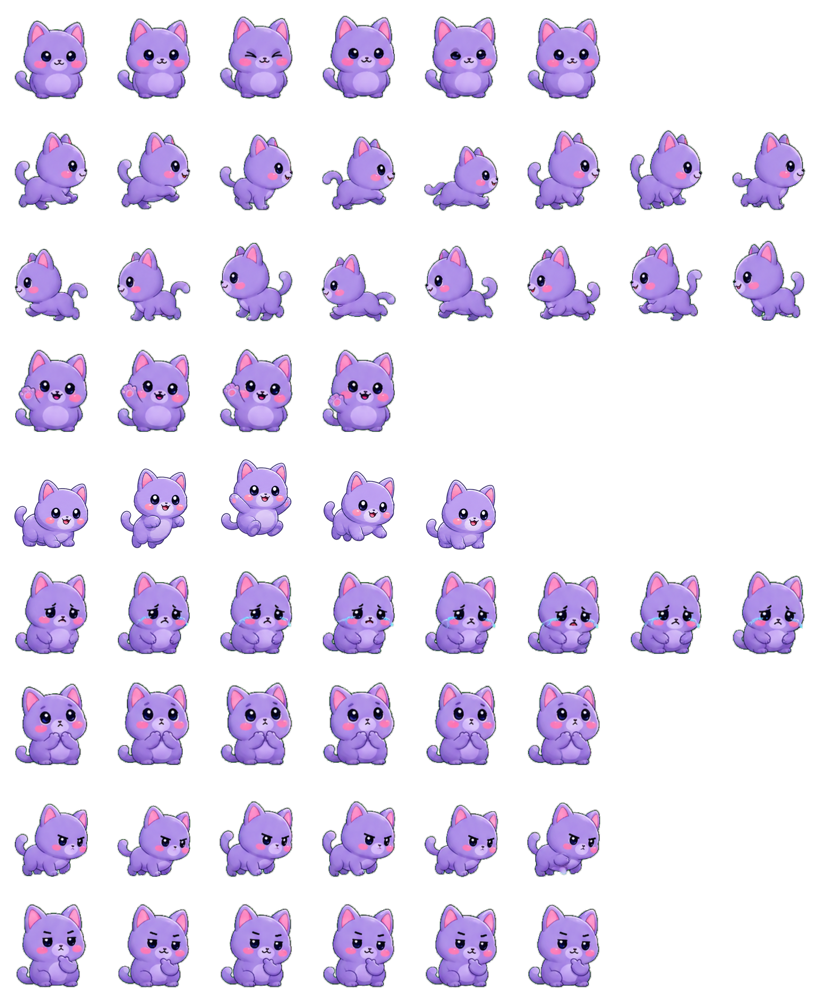
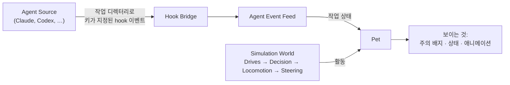

<!-- markdownlint-disable MD033 MD041 -->
<div align="center">

<!-- TODO(maintainer): 실제 로고/배너로 교체 (예: docs/assets/logo.png) -->


<h1>Pets Driven</h1>

<p><strong>코딩 에이전트를 데스크톱 펫으로.</strong><br/>
프로젝트마다 작은 컴패니언 하나가 데스크톱에 삽니다. 스스로 걷고, 졸고, 놀다가 —
자신의 에이전트가 당신을 필요로 하는 순간 번쩍 주의를 요청합니다.</p>

<!-- TODO(maintainer): 저장소가 공개되면 배지를 실제 repo로 연결 -->
[](./LICENSE)


[English](./README.md) · **한국어**

[기능](#-기능) · [펫 소개](#-펫-소개) · [작동 방식](#-작동-방식) · [시작하기](#-시작하기) · [에이전트 연동](#-에이전트-연동)

</div>

<!-- TODO(maintainer): 데모 GIF 삽입 — 펫이 돌아다니다가 에이전트 작업 완료에 반응하는 장면.
     데스크톱 펫 README에서 가장 중요한 자산입니다. -->
<div align="center">
  
</div>

---

## Pets Driven이란?

코딩 에이전트를 실행하면 실제 작업은 터미널 속에 파묻힙니다. **Pets Driven**은 그 작업에
얼굴을 부여합니다. 등록한 프로젝트 폴더마다 **펫 하나**가 생기고 — 데스크톱에 살면서 정확히
하나의 에이전트 실행을 대변하는 작은 캐릭터입니다.

펫은 서로 독립적인 두 축 위에서 두 가지를 동시에 보여줍니다:

- **에이전트가 무엇을 하고 있는지** — `working`(작업 중), `waiting`(대기), `completed`(완료),
  `failed`(실패), `idle`(유휴). hook 기반 이벤트 피드를 통해 에이전트가 직접 보고합니다.
- **펫이 무엇을 하고 있는지** — 돌아다니기, 폴짝 뛰기, 이웃과 수다 떨기. 시뮬레이션이 스스로
  계산하는 자율적인 삶입니다.

그래서 한 번 흘긋 보는 것만으로 방 전체의 분위기와 내 작업 상태를 함께 파악할 수 있습니다.
에이전트가 작업을 끝내거나, 멈추거나, 결정을 기다릴 때 해당 펫은 동작을 멈추고 **주의 배지**를
띄운 채 기다립니다. 당신은 펫을 **쓰다듬어서**(작은 스트로크 제스처) 이를 확인하고, 펫은 다시
자기 일상으로 돌아갑니다.

> 펫 하나 ⇄ 작업 디렉터리 하나 ⇄ 에이전트 하나. 공용 수신함도, 모호한 알림도 없습니다 —
> 폴더가 곧 정체성입니다.

## ✨ 기능

- 🐾 **프로젝트당 펫 하나** — 등록된 작업 디렉터리마다 에이전트에 묶인 펫이 하나씩 생겨, 병렬로 도는 에이전트들이 뒤섞이지 않습니다.
- 🖥️ **데스크톱 위에 삽니다** — 펫은 투명 오버레이 창으로, 작업표시줄 위 화면 바닥을 따라 걸어 다니며, 펫 본체를 제외한 모든 영역은 클릭이 통과합니다.
- 🔔 **직접 확인해야 사라지는 주의 요청** — `waiting`, `failed`, `completed` 이벤트는 주의 상태(attention hold)를 만들고, 당신이 *쓰다듬을* 때까지 유지됩니다. 알림이 슬그머니 사라지지 않습니다.
- 🧠 **진짜 작은 마음** — Drives → Decision → Locomotion → Steering 파이프라인(물리 엔진은 Matter.js)이 자율 행동을 이끌며, 쓰다듬김·놀람·작업 완료에 반응하는 짧은 **무드(mood)**가 색을 입힙니다.
- 👥 **펫끼리 어울립니다** — 가까운 펫들이 인사하고, 수다 떨고, 서로 쫓는 짧은 그룹 세션을 갖다가 흡족한 여운(afterglow)과 함께 마무리합니다.
- 🖥️🖥️ **멀티 모니터 인식** — 하나의 공유 시뮬레이션 월드가 가상 데스크톱 전체에 걸쳐 있어, 펫들이 여러 모니터를 하나의 연속된 공간처럼 돌아다닙니다.
- 🎭 **성격과 에셋** — "탄생" 시 외형과 기질을 고르고, 나중에 조정하거나, 에이전트 스킬의 도움을 받아 에셋을 성격 프리셋에 매핑할 수 있습니다.
- 🔌 **에이전트 비종속 브리지** — 가벼운 hook 브리지가 작업 디렉터리를 기준으로 에이전트 이벤트를 전달하므로, 터미널이 앱 안에 있든 밖에서 붙였든 펫이 반응합니다.
- 🌏 **다국어 지원** — 영어와 한국어를 기본 제공합니다.

## 🐾 펫 소개

여섯 컴패니언이 기본 내장되어 있습니다. 각각은 작업 상태를 표현하는 풍부한 애니메이션을 담은
스프라이트 아틀라스입니다.

| 펫 | 캐릭터 | 설명 |
|-----|--------|------|
| **Bloop** | 🐸 민트 개구리 | 둥글게 솟은 눈, 발그레한 볼, 순한 익살스러운 표정 |
| **Cato** | 🐱 라벤더 고양이 | 부드러운 둥근 비율, 반짝이는 눈, 발그레한 볼 |
| **Fenn** | 🦊 코랄 여우 | 뾰족한 작은 귀, 복슬복슬한 꼬리, 반짝이는 눈 |
| **Mochi** | 🐰 핑크 토끼 | 길고 부드러운 귀, 반짝이는 눈, 발그레한 볼 |
| **Otto** | 🐶 골든 강아지 | 축 늘어진 귀, 반짝이는 눈, 발그레한 볼 |
| **Pip** | 🐦 하늘색 새 | 작은 날개, 깃털 뭉치, 반짝이는 눈 |

> 커스텀 외형이 필요하신가요? 에셋은 앱이 제자리에서 참조하는 설치형 패키지입니다 —
> 스프라이트 구조와 추가 방법은 [`pets/README.md`](./pets/README.md)를 참고하세요.

## 🧩 작동 방식

펫은 매 프레임 위에서 아래로 흐르는 체인을 거치며, 자신의 상태를 두 축으로 보여줍니다.
에이전트는 오직 *이벤트*만 밀어 넣고, 펫이 어떻게 보이고 행동하는지는 전부 로컬에서 결정됩니다.



- **Agent Work State**(에이전트가 보고)는 색조와 긴급도를 결정합니다.
- **Activity**(시뮬레이션이 계산)는 펫이 자율적으로 무엇을 하는지 결정합니다.
- 완료된 작업은 **리뷰 홀드(review hold)**가 됩니다 — 조용히 초기화되지 않고, 당신이 알아챌 때까지 기다립니다.

전체 도메인 모델, 공통 용어(ubiquitous language), 아키텍처 다이어그램은
[`CONTEXT.md`](./CONTEXT.md)를 참고하세요.

## 🚀 시작하기

> **상태:** 초기 개발 단계(`v0.1.0`). 현재 번들 타깃은 Windows이며, [Tauri](https://tauri.app)로
> 만들어졌기에 macOS와 Linux는 로드맵에 있습니다. 지금은 소스에서 실행하세요.

### 사전 준비

- [Node.js](https://nodejs.org)와 [pnpm](https://pnpm.io) `10.x`
- [Rust 툴체인](https://www.rust-lang.org/tools/install) (Tauri 데스크톱 셸용)
- Tauri 플랫폼 사전 준비 — [Tauri 설정 가이드](https://tauri.app/start/prerequisites/) 참고

### 데스크톱 앱 실행

```bash
# 1. 의존성 설치
pnpm install

# 2. Tauri 데스크톱 앱 실행 (데스크톱 위의 펫)
pnpm dev

# 또는 브라우저 플레이그라운드로 시뮬레이션 미리보기 (네이티브 셸 없이)
pnpm dev:playground
```

### 빌드

```bash
pnpm build            # 데스크톱 앱 번들
pnpm test             # 테스트 스위트 실행
pnpm check            # 린트 + 포맷 검사 (Biome)
```

## 🤖 에이전트 연동

Pets Driven은 플러그인([`plugins/pets-driven`](./plugins/pets-driven))을 제공하여, 에이전트가
펫을 부화시키고 진행 상황을 보고할 수 있도록 슬래시 명령과 hook 브리지를 추가합니다:

| 명령 | 하는 일 |
|------|---------|
| **`hatch`** | 현재 폴더에 펫 생성 — 에셋과 성격을 선택합니다. |
| **`attach`** | 이 폴더에 묶인 펫에 핑을 보내 브리지 연결을 확인합니다. |
| **`bring`** | 에이전트 폴더로 프로젝트를 가져오고(`git clone` 또는 `git worktree`) 펫에 넘깁니다. |
| **`carry`** | 에이전트가 한 일과 그 작업의 위치를 다음 에이전트를 위한 간결한 인계문으로 요약합니다. |

이벤트는 프로바이더의 세션 id를 신뢰하는 대신 **작업 디렉터리**로 펫에 매칭됩니다 — 그래서
터미널을 앱 밖에서 붙였더라도 펫이 반응합니다.

## 🗂️ 프로젝트 구조

pnpm 모노레포입니다:

```
apps/
  desktop/        # Tauri + React 데스크톱 앱 (Pet Surface)
  web/            # Next.js 랜딩 / 웹 서피스
packages/
  pet-engine/     # 시뮬레이션: drives, decisions, physics, social sessions
  design-system/  # 공유 UI 컴포넌트
  i18n/           # 로컬라이제이션 (en, ko)
pets/             # 내장 펫 에셋 (단일 원천)
plugins/
  pets-driven/    # 에이전트 플러그인: commands, hooks, skills
scripts/          # 에셋 동기화, 버전 관리, 릴리스 도구
```

## 🤝 기여하기

기여를 환영합니다! 몇 가지 규칙이 있습니다:

- 저장소 내 문서, 코드 주석, 커밋 메시지는 모두 **영어**로 작성합니다
  ([`AGENTS.md`](./AGENTS.md) 참고). 이 한국어 README는 한국어 사용자를 위한 로컬라이즈 버전이며,
  정식 문서는 [`README.md`](./README.md)입니다.
- 풀 리퀘스트를 열기 전에 `pnpm check`와 `pnpm test`를 실행하세요.
- 도메인이 처음이신가요? 먼저 [`CONTEXT.md`](./CONTEXT.md)를 읽어보세요 — 코드베이스 전체가
  사용하는 어휘를 정의합니다.

## 📄 라이선스

[MIT](./LICENSE) © 2026 pets-driven contributors.

<div align="center">
<sub>로그 벽을 훑기보다 행복한 펫을 흘긋 보고 싶은 개발자를 위해 만들었습니다.</sub>
</div>
