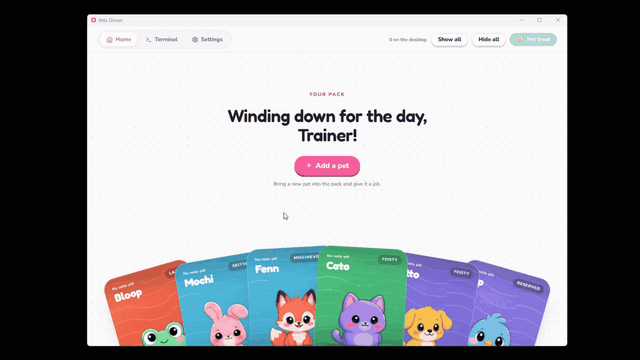
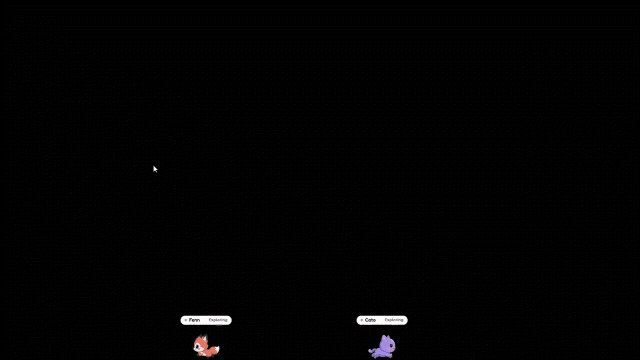
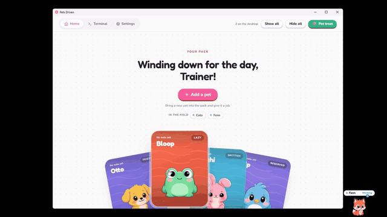
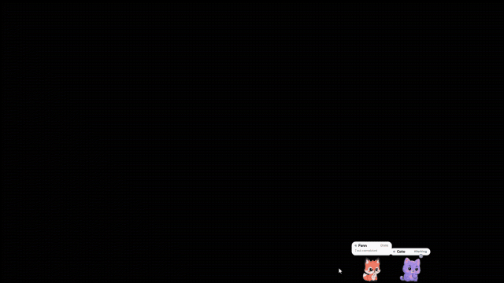
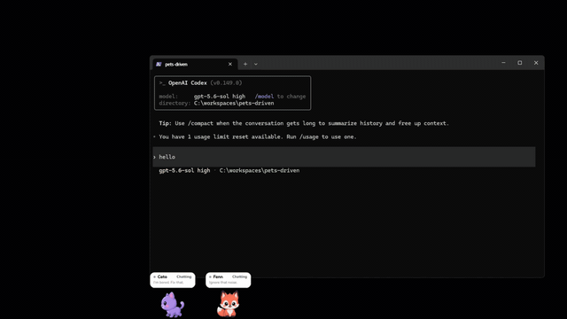
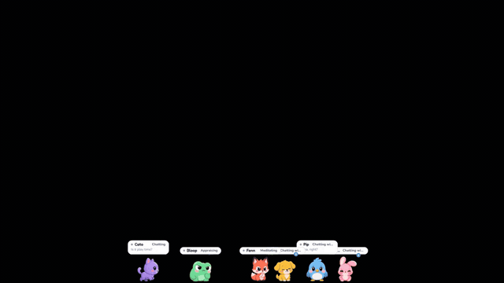
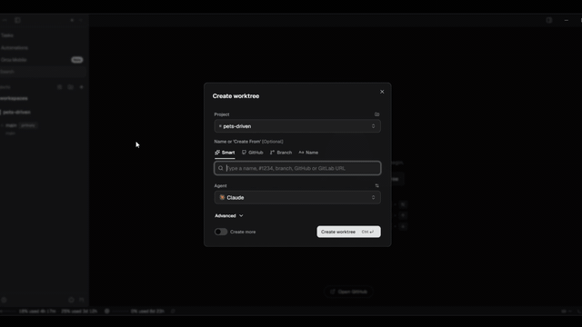

<!-- markdownlint-disable MD033 MD041 -->

<h1>Pets Driven</h1>

A desktop app for multi-agent work

**English** · [한국어](./README.ko.md)

[How you use it](#-how-you-use-it) · [Features](#-features) · [Download](#-download)

## 🎬 How you use it

### 1. Pick a pet and bind it to a project

One pet per directory. Pick one from the cards and it walks out onto your desktop.

### 2. Use your terminal as usual

Run your agent the way you always do, and the pet shows its status for you.

### 3. Take one out and play, even with nothing running

Your pets are on the desktop whether or not work is running. Take them out, toss them around, hand them a treat.

### 4. When it's done, the pet calls you

Completed, failed, and waiting all make the pet stop and flag you. Pet it or click it.

## 🧩 It does this too

|  |  |
| :-- | :-- |
|  | **Codex works too** Not Claude Code only. Pets react through the same hooks in the OpenAI Codex CLI. |
|  | **Leave them alone and they play** With nothing to do, pets greet each other, chat, and give chase. They don't only live while you're watching. |
|  | **Works with Orca** Two lines in your worktree hooks — `pdd hatch` and `pdd delete` — are all it takes. Every worktree gets its own pet, and clearing the worktree clears the pet with it. → [How to set it up](./crates/pets-driven-cli/README.md#orca-worktree-hooks) |

---

## ✨ Features

- 🔔 **It tells you when work finishes**
- 🧠 **A real little mind**, 👥 **pets socialize**, 🎭 **personalities & assets**
- ⌨️ **The CLI does all of it** — `pdd` alone hatches a pet, renames it, re-skins it, re-tempers it, and deletes it. It works with the app closed, and its JSON output pipes straight into a script. The installer ships it and puts it on your PATH. → [Full command list](./crates/pets-driven-cli/README.md)
- 🤖 **Agents drive it themselves** — plugins for both Claude Code and Codex are included. `hatch` creates a pet, `bring` pulls a repo into a worktree, and `carry` hands the work off to the next agent. Hooks forward agent events to the app, so the pet reacts. → [Browse the plugin](./plugins/pets-driven)

## ⬇️ Download

The badge downloads the newest installer directly. Run the `.exe` and you're done.
Want to see what's in it first? Browse the **[latest release](https://github.com/young1the/pets-driven/releases/latest)**.

> macOS and Linux builds aren't published yet. The app is built with [Tauri](https://tauri.app), so they're on the roadmap.
> Until then, please build from source.

## 📄 License

[MIT](./LICENSE) © 2026 pets-driven contributors.
