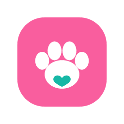
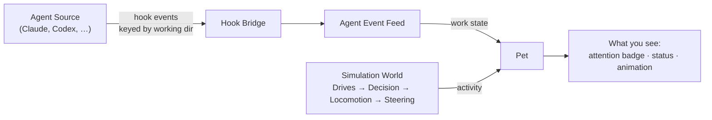

<!-- markdownlint-disable MD033 MD041 -->
<div align="center">



<h1>Pets Driven</h1>

<p><strong>Your coding agents, as desktop pets.</strong><br/>
A little companion lives on your desktop for each project. It walks, naps, and plays on its own —
and springs to attention the moment its agent needs you.</p>

<!-- TODO(maintainer): point badges at the real repo once it's public -->
[](./LICENSE)


**English** · [한국어](./README.ko.md) <!-- TODO(maintainer): add README.ko.md -->

[Features](#-features) · [Meet the pets](#-meet-the-pets) · [How it works](#-how-it-works) · [Getting started](#-getting-started) · [Agent integration](#-agent-integration)

</div>

<!-- TODO(maintainer): drop a short demo GIF here — a pet wandering, then reacting to a finished agent task.
     This is the single most important asset for a desktop-pet README. -->
<div align="center">
  
</div>

---

## What is Pets Driven?

When you run a coding agent, its real work is buried in a terminal. **Pets Driven** gives that work
a face. Every project folder you register gets **one pet** — a small character that lives on your
desktop and stands in for exactly one agent execution.

The pet shows two things at once, on two independent axes:

- **What the agent is doing** — `working`, `waiting`, `completed`, `failed`, or `idle`, reported by
  the agent through a hook-driven event feed.
- **What the pet is doing** — wandering, hopping, chatting with a neighbor — an autonomous life the
  simulation computes on its own.

So a glance tells you both the mood of the room and the state of your work. When an agent finishes,
stalls, or needs a decision, the bound pet stops, shows an **attention badge**, and waits. You
acknowledge it by **petting** it — a small stroke gesture — and it settles back into its day.

> One pet ⇄ one working directory ⇄ one agent. No shared inbox, no ambiguous notifications —
> the folder is the identity.

## ✨ Features

- 🐾 **One pet per project** — each registered working directory gets a single pet bound to its agent, so parallel agents never blur together.
- 🖥️ **Lives on your desktop** — pets are transparent overlay windows that walk along your screen floor, above the taskbar, with click-through everywhere except the pet itself.
- 🔔 **Attention that you dismiss on purpose** — `waiting`, `failed`, and `completed` events raise an attention hold that stays until you *pet* it. Notifications don't quietly disappear.
- 🧠 **A real little mind** — a Drives → Decision → Locomotion → Steering pipeline (physics by Matter.js) drives autonomous behavior, colored by a short-lived **mood** that reacts to being petted, startled, or finishing work.
- 👥 **Pets socialize** — nearby pets greet, chat, and chase each other in transient group sessions, then wind down with a contented afterglow.
- 🖥️🖥️ **Multi-monitor aware** — one shared simulation world spans your whole virtual desktop, so pets roam across monitors as a single continuous space.
- 🎭 **Personalities & assets** — pick a look and a temperament at "birth," tune it later, or let an agent skill help map an asset to a personality preset.
- 🔌 **Agent-agnostic bridge** — a lightweight hook bridge forwards agent events by working directory, so pets react whether the terminal is inside the app or attached from outside.
- 🌏 **Localized** — English and Korean out of the box.

## 🐾 Meet the pets

Six companions ship built in. Each is a sprite atlas with expressive, task-aware animations.

| Pet | Character | Description |
|-----|-----------|-------------|
| **Bloop** | 🐸 Mint frog | Round raised eyes, rosy cheeks, a gentle goofy face |
| **Cato** | 🐱 Lavender cat | Soft rounded proportions, glossy eyes, rosy cheeks |
| **Fenn** | 🦊 Coral fox | Sharp little ears, a fluffy tail, glossy eyes |
| **Mochi** | 🐰 Pink bunny | Tall soft ears, glossy eyes, rosy cheeks |
| **Otto** | 🐶 Golden puppy | Floppy ears, glossy eyes, rosy cheeks |
| **Pip** | 🐦 Sky-blue bird | Little wings, a feather tuft, glossy eyes |

> Want a custom look? Assets are installed packages the app references in place — see
> [`pets/README.md`](./pets/README.md) for the sprite layout and how to add one.

## 🧩 How it works

A pet moves through a top-down chain every frame, and shows its state on two axes. The agent only
ever pushes *events*; everything about how a pet looks and behaves is decided locally.



- **Agent Work State** (from the agent) drives tone and urgency.
- **Activity** (from the simulation) drives what the pet is autonomously doing.
- A completed task becomes a **review hold** — it waits to be noticed instead of silently resetting.

For the full domain model, ubiquitous language, and architecture diagrams, see
[`CONTEXT.md`](./CONTEXT.md).

## 🚀 Getting started

> **Status:** early development (`v0.1.0`). Windows is the current bundle target; the app is built
> with [Tauri](https://tauri.app), so macOS and Linux are on the roadmap. For now, run from source.

### Prerequisites

- [Node.js](https://nodejs.org) and [pnpm](https://pnpm.io) `10.x`
- The [Rust toolchain](https://www.rust-lang.org/tools/install) (for the Tauri desktop shell)
- Platform prerequisites for Tauri — see the [Tauri setup guide](https://tauri.app/start/prerequisites/)

### Run the desktop app

```bash
# 1. Install dependencies
pnpm install

# 2. Launch the Tauri desktop app (pets on your desktop)
pnpm dev

# Or preview the simulation in the browser playground (no native shell)
pnpm dev:playground
```

### Build

```bash
pnpm build            # bundle the desktop app
pnpm test             # run the test suites
pnpm check            # lint + format check (Biome)
```

## 🤖 Agent integration

Pets Driven ships a plugin ([`plugins/pets-driven`](./plugins/pets-driven)) that adds slash
commands and a hook bridge so your agent can hatch pets and report progress:

| Command | What it does |
|---------|--------------|
| **`hatch`** | Create a pet for the current folder — choose its asset and personality. |
| **`attach`** | Ping the pet bound to this folder to confirm the bridge is connected. |
| **`bring`** | Pull a project into an agent's folder (`git clone` or `git worktree`) and hand it to a pet. |
| **`carry`** | Summarize what an agent did and where the work lives into a compact handoff for the next agent. |

Events are matched to pets by **working directory**, not by trusting a provider's session id — so a
pet reacts even when its terminal is attached from outside the app.

## 🗂️ Project structure

This is a pnpm monorepo:

```
apps/
  desktop/        # Tauri + React desktop app (the Pet Surface)
  web/            # Next.js landing / web surface
packages/
  pet-engine/     # the simulation: drives, decisions, physics, social sessions
  design-system/  # shared UI components
  i18n/           # localization (en, ko)
pets/             # built-in pet assets (source of truth)
plugins/
  pets-driven/    # agent plugin: commands, hooks, skills
scripts/          # asset sync, versioning, release tooling
```

## 🤝 Contributing

Contributions are welcome! A few house rules:

- All in-repo docs, code comments, and commit messages are written in **English**
  (see [`AGENTS.md`](./AGENTS.md)).
- Run `pnpm check` and `pnpm test` before opening a pull request.
- New to the domain? Read [`CONTEXT.md`](./CONTEXT.md) first — it defines the vocabulary the whole
  codebase uses.

## 📄 License

[MIT](./LICENSE) © 2026 pets-driven contributors.

<div align="center">
<sub>Built for developers who'd rather glance at a happy pet than scan a wall of logs.</sub>
</div>
