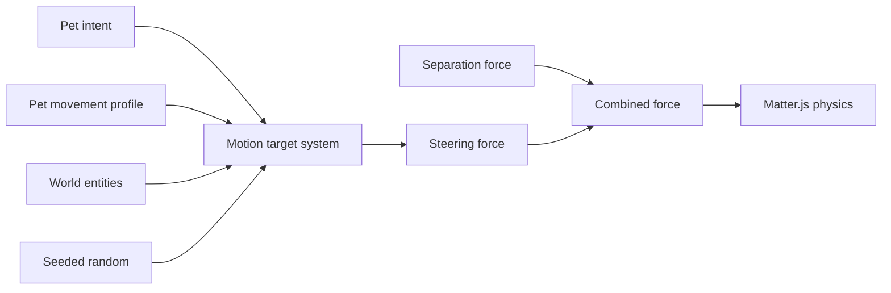

# Intent-Driven Movement Pass Design

## Goal

Translate visible pet intent into actual motion in the browser simulation by introducing targetable world entities, pet-owned movement profiles, and deterministic steering behavior.

## Context

The current browser slice already provides:

- neutral event injection
- visible pet status
- canvas labels and speech bubbles
- fixture pets with readable names

The next missing piece is motion. Pets currently change state, but they do not yet behave differently in space when they are `idle`, `active`, or `seek-user`.

## Scope

### In Scope

- add targetable world entities
- model the user anchor as a world entity, not a special coordinate
- give each pet its own movement profile
- add runtime motion target state to each pet
- make `idle`, `active`, and `seek-user` produce different movement behavior
- use seedable randomness for deterministic waypoint choice
- combine intent steering with existing separation steering
- verify movement through deterministic tests and browser-visible snapshots

### Out of Scope

- food bowls or other additional world objects
- needs systems
- behavior tree abstraction
- generating movement profiles from personality components
- draggable user anchor UI
- provider-specific integration

## Recommended Approach

Use an intent-driven steering layer:



This keeps movement composable:

- targets belong to the world
- movement tuning belongs to each pet
- steering remains a system concern

## World Entities

The first pass adds one actual targetable world entity:

```ts
type WorldEntity =
  | {
      id: string;
      kind: "user-anchor";
      position: {
        x: number;
        y: number;
      };
    };
```

The default demo fixture places the user anchor at the lower center of the world, but callers must be able to override its position when creating the world. This keeps the model ready for later entities such as food bowls, toys, or other interaction targets without turning the user into a special coordinate case.

## Pet-Owned Movement

Movement tuning belongs to each pet entity:

```ts
type MovementProfile = {
  idleSpeed: number;
  activeSpeed: number;
  seekUserSpeed: number;
};
```

This is intentionally pet-owned rather than world-global. Different pets should eventually move differently as a result of their composition and personality.

Each pet also carries runtime motion state:

```ts
type PetMotionState = {
  targetEntityId: string | null;
  targetPosition: {
    x: number;
    y: number;
  } | null;
};
```

`targetEntityId` keeps the system ready for moving targets. `targetPosition` preserves the concrete point used for the current steering decision.

## Behavior Rules

### Idle

- chooses a seeded random waypoint when no target exists or the current waypoint has been reached
- moves toward that waypoint using `idleSpeed`

### Active

- follows the same waypoint logic as idle
- moves using `activeSpeed`

### Seek User

- finds the world entity with `kind: "user-anchor"`
- sets `targetEntityId` to that entity id
- moves toward the entity position using `seekUserSpeed`

### Separation

- separation remains active regardless of intent
- separation force is combined with intent steering before physics is stepped

## Data Flow

Per world step:

1. process queued stimuli
2. run idle conversation
3. resolve motion targets from intent
4. compute intent steering
5. compute separation steering
6. apply combined forces to physics bodies
7. advance Matter.js
8. emit updated snapshots

## Determinism

Waypoint selection must use an injected random source, not `Math.random`.

Tests should be able to:

- provide a seeded random generator
- predict waypoint choice
- verify movement differences without flaky assertions

## Testing Strategy

### Unit Tests

- world contains a configurable `user-anchor` entity
- each fixture pet includes a movement profile
- `seek-user` resolves the `user-anchor`
- `idle` and `active` select deterministic waypoints with a seeded random source
- steering force uses different speed coefficients by intent
- separation contributes to applied motion when pets are close

### Integration Tests

- `task.waiting` moves Alice toward the user anchor over time
- `active` movement advances faster than `idle` movement under the same deterministic setup

### Browser Tests

- status remains visible while bodies change position
- waiting event causes Alice's snapshot position to move toward the anchor

## Expected File Structure

```text
src/
  core/
    entities/
      world-entity.ts
    systems/
      motion-target-system.ts
      intent-steering-system.ts
      separation-steering-system.ts
    world/
      create-world.ts
      scenario-fixtures.ts
tests/
  core/
    motion-target-system.test.ts
    intent-steering-system.test.ts
    world-fixtures.test.ts
```

## Acceptance Criteria

- the user anchor is represented as a world entity
- the user anchor position is configurable at world creation
- each demo pet owns its own movement profile
- `idle`, `active`, and `seek-user` produce distinct movement behavior
- `seek-user` targets the `user-anchor` entity
- random waypoint selection is deterministic under a fixed seed
- existing separation steering participates in actual motion
- browser-visible snapshots show Alice moving toward the user anchor after a waiting event

## Deferred Decisions

- additional target entities such as food bowls
- needs-driven target selection
- personality-driven movement-profile generation
- draggable or user-editable anchor placement
- explicit behavior tree nodes for motion
