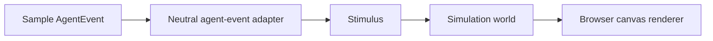

# Neutral Agent Event Adapter Design

## Goal

Build the next MVP slice after the simulation core: a source-agnostic adapter boundary that converts neutral agent events into simulation stimuli and lets the browser playground inject sample agent events for visual verification.

## Context

The first simulation-core slice already provides:

- a headless world model
- neutral stimuli
- pet behavior systems
- Matter.js-backed physics snapshots
- a browser canvas playground

The product eventually needs to accept Claude hooks on Windows and later other agent sources such as Codex and open agents. This slice intentionally does not implement Claude-specific mapping yet. It establishes the internal contract that future source adapters will target.

## Scope

### In Scope

- define a neutral `AgentEvent` model
- convert neutral `AgentEvent` values into core `Stimulus` values
- support `task.started`, `task.waiting`, and `task.completed`
- extend the world behavior so those three stimuli visibly affect pet runtime state
- extend the browser playground with three sample-event controls
- show the last injected neutral event in a read-only JSON panel
- cover the flow with unit, component, and POM-based end-to-end tests

### Out of Scope

- Claude hook payload parsing
- Windows or Tauri integration
- persistent event transport
- a generic event bus or registry
- editable JSON input
- support for agent events beyond the initial three task lifecycle events

## Recommended Approach

Use a narrow neutral adapter boundary now:



This keeps the core independent from external sources while avoiding a speculative event platform. Future source-specific adapters can map Claude, Codex, or open-agent payloads into the same neutral event model without changing the world contract.

## Domain Model

The initial neutral event vocabulary is:

```ts
type AgentEvent =
  | {
      type: "task.started";
      sourceId: string;
      at: number;
      summary?: string;
    }
  | {
      type: "task.waiting";
      sourceId: string;
      at: number;
      summary?: string;
    }
  | {
      type: "task.completed";
      sourceId: string;
      at: number;
      summary?: string;
    };
```

`AgentEvent` is an internal product model. It is not a Claude hook model and does not preserve any external provider-specific fields.

## Adapter Boundary

The neutral adapter exports one focused operation:

```ts
function toStimulus(event: AgentEvent): Stimulus;
```

For the first slice, the mapping is intentionally one-to-one:

- `task.started` -> `task.started`
- `task.waiting` -> `task.waiting`
- `task.completed` -> `task.completed`

The value of the adapter is not transformation complexity yet. It is the stable seam that prevents future provider payloads from entering the simulation core directly.

## Runtime Behavior

The world should make all three task lifecycle events visible:

- `task.started`
  - records recent activity
  - clears stale speech
  - keeps or returns the pet to an active intent
- `task.waiting`
  - moves the pet into a user-seeking intent
  - shows the provided short summary when available
- `task.completed`
  - records recent activity
  - returns the pet to an idle intent
  - shows the provided short summary when available

These changes are deliberately small. They make the lifecycle legible without introducing a broader animation or state-machine redesign in the same slice.

## Playground Experience

Replace the single waiting stimulus control with three sample-event controls:

- `Send started event`
- `Send waiting event`
- `Send completed event`

Add a compact read-only JSON panel showing the last injected `AgentEvent`. The panel is a playground tool surface, not product copy. It exists so developers can see exactly what entered the neutral adapter while watching the pets react.

The browser playground remains backend-agnostic:

- no direct Tauri calls
- no Claude-specific naming
- no dependency on an installed desktop runtime

## Error Handling

The neutral adapter should reject malformed inputs at its boundary rather than silently swallowing them. This slice can model that as a typed constructor or validator that produces only valid `AgentEvent` values before mapping them into `Stimulus`.

When provider-specific adapters arrive later, parsing errors from external payloads should be handled in those provider adapters before neutral events reach this layer.

## Testing Strategy

### Unit Tests

- neutral agent events map into matching stimuli
- invalid neutral event input is rejected
- world behavior changes correctly for started, waiting, and completed stimuli

### Component Tests

- the playground renders three sample-event buttons
- clicking each button updates the last-event JSON panel
- clicking each button routes through the neutral adapter rather than constructing stimuli inline

### End-to-End Tests

- use the existing page object model
- verify the playground exposes all three event controls
- send each sample event
- verify the last-event JSON panel reflects the injected payload

## File Structure

Expected additions and changes:

```text
src/
  adapters/
    agent-events/
      agent-event.ts
      agent-event-adapter.ts
  core/
    stimuli/
      stimulus.ts
    systems/
      stimulus-reaction-system.ts
  playground/
    browser/
      playground-app.tsx
      playground-text.ts
      scenario-controls.tsx
      agent-event-panel.tsx
tests/
  adapters/
    agent-event-adapter.test.ts
  core/
    systems.test.ts
  smoke/
    playground-app.test.tsx
e2e/
  pages/
    playground.page.ts
  playground.spec.ts
```

## Acceptance Criteria

- the app has a source-agnostic `AgentEvent` contract
- `task.started`, `task.waiting`, and `task.completed` convert into stimuli through an adapter boundary
- the simulation visibly responds to all three lifecycle events
- the browser playground can inject all three sample events without backend dependencies
- the last injected neutral event is visible as read-only JSON
- unit, component, build, and POM-based end-to-end tests pass

## Deferred Decisions

- exact Claude hook event mappings
- how source adapters are discovered and registered
- persistence of user-visible event history
- richer pet state transitions beyond the first three task lifecycle events
