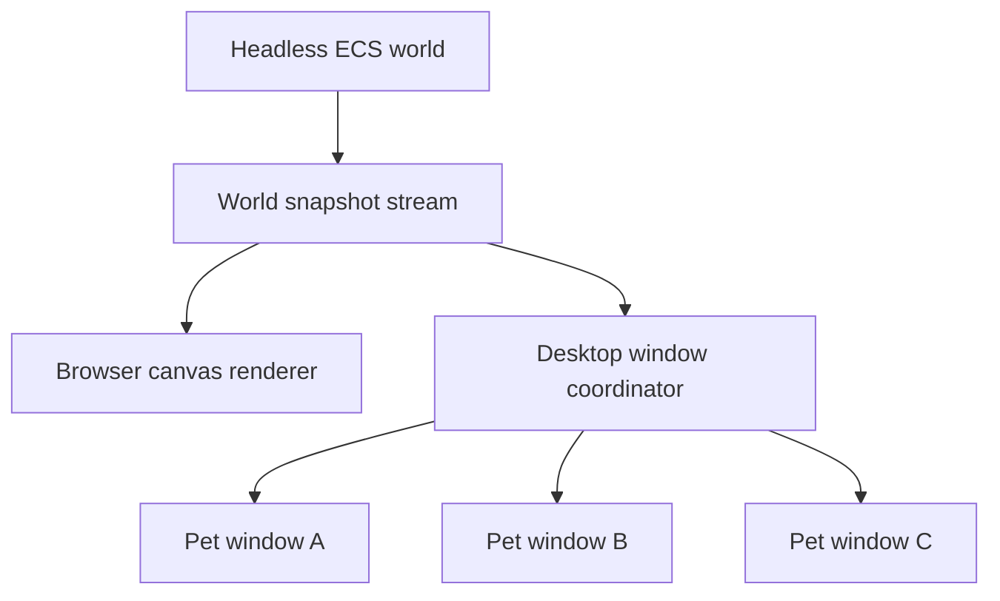
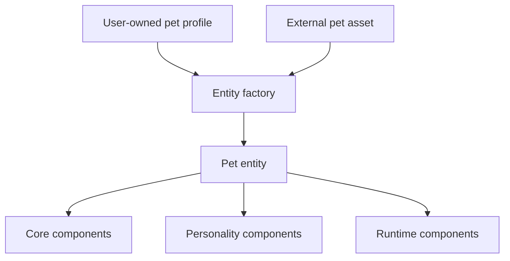
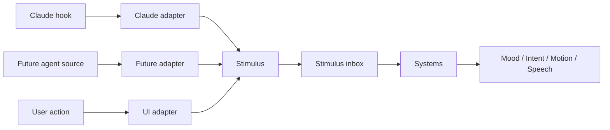
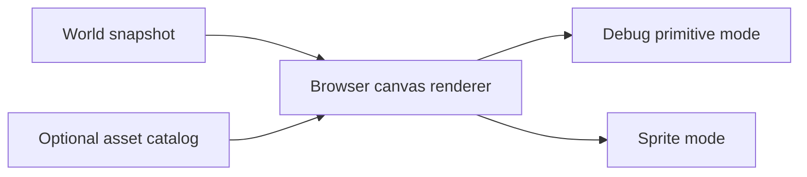

# pets-driven Simulation Core Design

## Product Context

`pets-driven` is a desktop experience for multiple agents with the working description:

> A cute way to deployment with multiple agents

The long-term product goal is to make multi-agent work feel alive, legible, and emotionally pleasant through desktop pets that reflect agent activity. The first MVP target is Windows with Claude hooks feeding agent activity into a desktop experience, but the product architecture must leave room for future macOS support and additional agent sources such as Codex and other open agents.

The product priority order for the MVP is:

1. Emotional companionship
2. State visibility
3. Operational control

The first implementation subproject is not the full desktop application. It is the standalone simulation core that will later power the desktop experience.

## Scope Of This Design

This design defines the first subproject:

- a headless pet simulation core
- ECS-style composition for pet behavior
- physics-backed movement
- renderer-independent world snapshots
- a browser canvas playground for deterministic verification
- support for both debug visuals and real pet sprite rendering in the browser

This design intentionally does not define:

- the final Tauri shell
- the full Claude hook integration flow
- macOS support
- Codex or open-agent adapters
- runtime installation of new components through skills
- pet marketplaces or package distribution
- advanced world content such as terrain, objects, or pathfinding

## Core Architectural Decisions

### 1. The Simulation Core Is Headless

The simulation core must not know about:

- Claude
- Codex
- Tauri
- Windows
- native windows
- pet sprite assets

It owns only:

- entities
- components
- systems
- physics
- stimuli
- world state
- snapshots

The same simulation must run:

- inside automated tests
- inside a browser playground
- later behind a desktop renderer

### 2. The World Is Shared, Renderers Are Pluggable

There is one shared simulation world. Multiple visual surfaces may render that world.



This keeps:

- pet-to-pet collision real
- steering behavior coherent
- simulation logic independent from any rendering host

The browser playground and future Tauri windows are consumers of the same snapshot contract.

### 3. The Core Receives Stimuli, Not Agent Concepts

External systems translate their own events into domain-neutral stimuli before the simulation sees them.

Examples:

- `task.started`
- `task.waiting`
- `task.completed`
- `task.failed`
- `attention.requested`

Claude hooks are therefore handled by an adapter outside the core. Future Codex or open-agent adapters can map into the same stimulus vocabulary without changing the simulation model.

### 4. Physics Uses A Proven Library

The simulation should use a proven 2D physics library rather than building a physics engine from scratch. The initial choice is Matter.js.

Matter.js is used for:

- bodies
- collisions
- gravity
- friction
- impulses
- spatial resolution

The product-owned logic remains responsible for:

- ECS composition
- behavior systems
- intent selection
- personality
- animation state
- speech decisions

## Domain Model

### External Pet Assets

External pet assets follow the Codex pet package contract produced by `hatch-pet`.

Each package contains:

```text
pet.json
spritesheet.webp
```

The external `pet.json` manifest remains intentionally small:

```json
{
  "id": "pet-name",
  "displayName": "Pet Name",
  "description": "One short sentence.",
  "spritesheetPath": "spritesheet.webp"
}
```

This manifest is an external asset contract. It describes how to display a pet, not how that pet behaves inside `pets-driven`.

### User-Owned Pet Profiles

Behavioral composition belongs to a separate `pets-driven` model owned by the user.

A pet profile:

- references one external pet asset
- defines the user's chosen personality component composition
- may be created from a preset, then customized
- is the model that produces runtime pet entities

Example:

```json
{
  "id": "my-jori",
  "petAssetId": "jori",
  "components": [
    { "type": "Curious", "weight": 0.9 },
    { "type": "Talkative", "idleAfterMs": 9000 },
    { "type": "SeeksCompany", "radius": 140 },
    { "type": "AvoidsCrowds", "radius": 80 }
  ]
}
```

### Service-Owned Personality Components

The service owns executable personality components and the systems that interpret them.

Examples:

- `Curious`
- `Talkative`
- `AvoidsCrowds`
- `SeeksUser`
- `SeeksCompany`

Each personality component is:

- reusable across many pet profiles
- validated through a component registry
- interpreted by one or more systems

### Service-Owned Presets

The service may provide reusable personality presets as starting points.

Examples:

- `playful`
- `attentive`
- `reserved`

Presets are not pet profiles. They are reusable component bundles that help users create their own profiles.

Example:

```json
{
  "id": "playful",
  "name": "Playful",
  "components": [
    { "type": "Curious", "weight": 0.9 },
    { "type": "Talkative", "idleAfterMs": 9000 },
    { "type": "SeeksCompany", "radius": 140 }
  ]
}
```

No service-owned profile should be created for a user's personal pet asset such as `Jori`. Personal pets remain user assets, and profiles remain user-owned configuration.

## ECS Model

The simulation uses ECS-style composition rather than inheritance.



### Core Components

Examples:

- `Transform`
- `PhysicsBody`
- `Velocity`
- `AnimationState`
- `SpriteRef`

### Personality Components

Examples:

- `Curious`
- `Talkative`
- `AvoidsCrowds`
- `SeeksUser`
- `SeeksCompany`

### Runtime Components

Examples:

- `Mood`
- `Intent`
- `Memory`
- `StimulusInbox`
- `Speech`

### Registry And Systems

The component registry defines:

- which component types exist
- their schemas
- which systems depend on them

Systems implement behavior. Example relationships:

- `Talkative` is consumed by `IdleConversationSystem`
- `AvoidsCrowds` is consumed by `SeparationSteeringSystem`
- `SeeksUser` is consumed by `AttentionSeekingSystem`

Future skills may add new component implementations and systems, but dynamic installation is out of scope for the first MVP. The core should expose clear extension points now so that future installation does not require redesigning the simulation model.

## Stimulus Flow



Example stimulus model:

```ts
type Stimulus =
  | { type: "task.started"; sourceId: string; at: number; summary?: string }
  | { type: "task.waiting"; sourceId: string; at: number; summary?: string }
  | { type: "task.completed"; sourceId: string; at: number; summary?: string }
  | { type: "task.failed"; sourceId: string; at: number; summary?: string }
  | { type: "attention.requested"; sourceId: string; at: number; summary?: string };
```

Stimuli are momentary events. Pet runtime state is derived over time from those stimuli through systems.

This means:

- adapters do not directly control pets
- pets react according to their own composition
- the same external event can produce different pet behavior depending on personality

## Rendering Model

### Browser Canvas Renderer

The browser canvas renderer must support both:

1. debug rendering with no pet assets loaded
2. sprite rendering when pet assets are available



### Debug Primitive Mode

When assets are absent, the renderer should still make the simulation visually inspectable with:

- colored bodies
- direction indicators
- velocity vectors
- collision bounds
- intent labels
- speech bubbles

This allows simulation work to proceed without any pet package installed.

### Sprite Mode

When assets are available, the same renderer should:

- load atlas sprites from pet packages
- map world animation state to atlas rows
- advance animation frames
- draw actual pet sprites on canvas
- preserve optional debug overlays

This allows the browser playground to validate:

- physics
- behavior
- animation
- visual feel

without requiring Tauri.

### Future Desktop Rendering

The future desktop shell should remain outside the core.

Its responsibilities will be:

- consume world snapshots
- create or manage independent pet windows
- map world coordinates to native desktop coordinates
- draw one pet per window

The desktop shell should not make behavior decisions.

## Determinism And Testing

The simulation should be deterministic whenever tests require it.

Required seams:

- injectable clock
- seedable randomness
- fixed timestep support
- scenario fixtures

### Test Layers

1. Pure unit tests
   - component schemas
   - registry validation
   - stimulus normalization
   - intent selection
   - animation mapping

2. Deterministic simulation tests
   - idle talk after a configured delay
   - crowd avoidance
   - waiting stimulus reaction
   - collision separation
   - distinct behavior from distinct compositions

3. Browser playground tests
   - world startup
   - stimulus injection
   - debug rendering
   - sprite rendering
   - bubble and animation state changes

4. Renderer contract tests
   - the browser renderer and future desktop renderer consume the same snapshot schema

## MVP Success Criteria

The first subproject is successful when:

- multiple pet entities run in one shared world
- entities are composed from reusable personality components
- different compositions create visibly different behavior
- stimuli change pet behavior without exposing agent-specific concepts to the core
- Matter.js-backed physics supports movement and collisions
- the browser canvas playground can display the world without any pet assets
- the same browser canvas playground can display real pet sprites when assets are available
- the simulation can be tested deterministically without Tauri

## Proposed Directory Structure

```text
src/
  core/
    world/
    ecs/
    physics/
    stimuli/
    systems/
    snapshots/

  pets/
    assets/
      pet-asset.ts
      pet-asset-repository.ts
      atlas-loader.ts
    profiles/
      pet-profile.ts
      pet-profile-repository.ts
    personalities/
      components/
        curious.ts
        talkative.ts
        avoids-crowds.ts
        seeks-user.ts
      presets/
        playful.json
        attentive.json
        reserved.json

  playground/
    browser/
      playground-app.tsx
      canvas-renderer.ts
      debug-overlay.ts
      scenario-controls.tsx

  adapters/
    stimuli/
      claude/
    host/
      browser/
      tauri/

  renderers/
    tauri-windows/

  shared/
    random/
    schema/
    time/
```

## Deferred Decisions

The following decisions should be addressed in later specs rather than this one:

- exact persistence format and storage location for user-owned pet profiles
- exact component packaging model for future skills
- the full stimulus vocabulary for every future agent source
- Tauri window lifecycle and multi-monitor behavior
- how user interactions with pets feed back into the world
- marketplace, installation, and sharing flows

## Summary

The first `pets-driven` subproject should establish a reusable game-like kernel:

- headless ECS world
- data-driven user profiles
- service-owned reusable personality components and presets
- proven physics
- adapter-fed stimuli
- renderer-independent snapshots
- a browser canvas playground that supports both debug visuals and real pet sprites

This gives the product a stable foundation while preserving the long-term goal: desktop pets that feel alive, reflect agent activity, and can grow through new behavior components over time.
