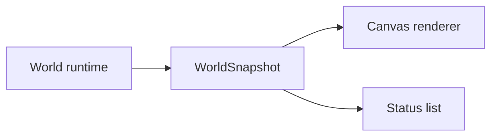

# Visual Pet State Pass Design

## Goal

Make pet state legible in the browser playground before adding desktop or provider-specific integration by extending the render snapshot with pet state and showing that state both on the canvas and in a companion status list.

## Context

The current browser playground can already:

- simulate multiple pets in one world
- react to neutral task lifecycle events
- render physics bodies and optional sprites
- inject neutral events without backend dependencies

The missing piece is visibility. The simulation state changes, but the screen does not yet explain enough about what each pet is doing. Before adding more complex low-level AI behavior, the playground needs a clearer visual readout.

## Scope

### In Scope

- extend `WorldSnapshot` with pet render state
- expose fixture pet names through the snapshot
- render each pet's `name`, `intent`, and optional speech bubble on the canvas
- add a tidy companion status list beside the canvas
- keep both canvas and status list driven by the same snapshot
- use fixture names `Alice`, `Bob`, and `Charlie`
- cover the slice with snapshot, renderer, component, and POM-based end-to-end tests

### Out of Scope

- editable names
- user-owned profile loading
- external `pet.json` loading
- desktop overlay placement
- personality-specific UI variants
- richer animation state modeling

## Recommended Approach

Use the world snapshot as the single render-facing contract:



The playground should not read runtime pet internals directly for one view and snapshots for another. A single snapshot keeps browser and future desktop renderers aligned around the same visual contract.

## Snapshot Model

Extend the world snapshot with pet state:

```ts
type PetSnapshot = {
  id: string;
  sourceId: string;
  name: string;
  intent: string;
  speech: string | null;
  position: {
    x: number;
    y: number;
  };
};

type WorldSnapshot = {
  bodies: BodySnapshot[];
  pets: PetSnapshot[];
};
```

`position` should align with the rendered body position so labels and speech bubbles remain attached to the visible pet.

## Demo Fixture Data

The demo scenario should use plainly synthetic fixture names:

- `Alice`
- `Bob`
- `Charlie`

These names are not service-owned pet profiles and do not imply any product-level character ownership. They exist only to make browser verification readable.

## Canvas Behavior

For each pet, the canvas renderer should draw:

- the existing sprite or debug primitive
- the pet name
- the current intent
- a speech bubble only when `speech` is present

The labels should remain compact and utilitarian. This slice is about observability, not final art direction.

## Status List

Add a compact status list that shows one row per pet:

- `name`
- `sourceId`
- `intent`
- `speech`

The list should feel like the first usable form of a product surface rather than a raw debug dump, but it should remain restrained and information-dense.

## Data Flow

1. The world updates runtime pet state.
2. `world.snapshot()` emits bodies plus pet render state.
3. The playground stores the latest snapshot for rendering.
4. The canvas renderer and status list both consume the same snapshot.

This keeps the renderer path backend-agnostic and leaves room for a future desktop renderer to consume the same model.

## Testing Strategy

### Snapshot Tests

- world snapshots include pet render state
- fixture names appear as `Alice`, `Bob`, and `Charlie`
- pet snapshot positions align with body positions

### Renderer Tests

- canvas draws pet names
- canvas draws pet intents
- canvas draws a speech bubble when speech is present
- canvas skips speech drawing when speech is absent

### Component Tests

- playground renders the status list for all fixture pets
- neutral event injection updates visible intent and speech values

### End-to-End Tests

- continue using the page object model
- send a waiting event
- verify the status list exposes `Alice`, `seek-user`, and the waiting summary

## Expected File Structure

```text
src/
  core/
    snapshots/
      world-snapshot.ts
    world/
      create-world.ts
      scenario-fixtures.ts
  playground/
    browser/
      canvas-renderer.ts
      pet-status-list.tsx
      playground-app.tsx
      playground-text.ts
tests/
  core/
    world-fixtures.test.ts
  playground/
    canvas-renderer.test.ts
  smoke/
    playground-app.test.tsx
e2e/
  pages/
    playground.page.ts
  playground.spec.ts
```

## Acceptance Criteria

- `WorldSnapshot` contains pet render state
- fixture pets are named `Alice`, `Bob`, and `Charlie`
- the canvas visibly renders each pet's name and intent
- speech bubbles appear only when speech exists
- the status list and canvas are driven by the same snapshot
- a waiting event visibly updates Alice to `seek-user` with speech
- unit, component, build, and POM-based end-to-end tests pass

## Deferred Decisions

- the final visual design of labels and bubbles
- personality-specific presentation
- user editing of names
- mapping between external pet assets and user-owned profiles
