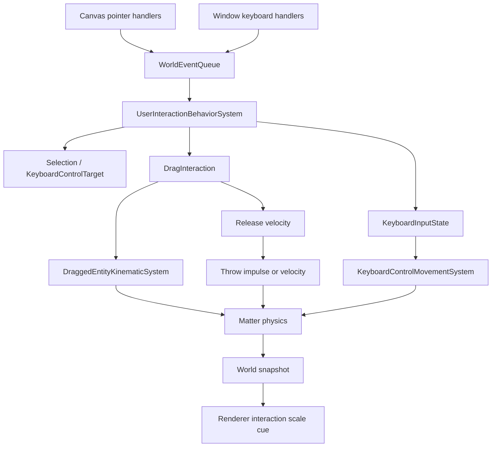

# User Interaction Pets Design

## Goal

Add first-class user interaction for movable world entities, starting with pets:

- drag and drop
- keyboard control mode
- throwing from drag release

These interactions must remain separate from autonomous behavior. User input has priority over agent events, collision reactions, and autonomous decisions, and each interaction preserves the right physical feel.

## Current Context

The simulation already has:

- a `WorldEvent` queue with pointer and keyboard event shapes
- `UserInteractionBehaviorSystem` in the first behavior priority slot
- Matter-backed physics and ECS components
- movement driven by `MotionTarget`, locomotion tags, steering, jump, and collision systems
- sprite animation selection based on motion target direction and body state

`UserInteractionBehaviorSystem` is currently a placeholder. This design fills that gap without collapsing user input into ordinary autonomous movement.

## Capability Model

User interaction is opt-in per entity.

Add capability components:

```ts
type CanDragComponent = {
  type: "CanDrag";
};

type CanControlComponent = {
  type: "CanControl";
  force: number;
};
```

Only entities with `CanDrag` can be directly grabbed. Only entities with `CanControl` can be assigned as a keyboard control target.

These capabilities are not pet-specific. A future movable object can opt in without pretending to be a pet.

## Selection And Control Target

Selection is separate from drag and drop.

Clicking a `CanControl` entity sets the keyboard control target. Keyboard control mode does nothing when no control target is set.

This keeps control explicit: the user must know which entity is being controlled before movement keys affect the simulation.

Add runtime components:

```ts
type KeyboardControlTargetComponent = {
  type: "KeyboardControlTarget";
  entityId: string | null;
};

type KeyboardInputStateComponent = {
  type: "KeyboardInputState";
  pressedCodes: string[];
  vector: { x: number; y: number };
};
```

There is one world-level keyboard target and one world-level keyboard input state.

## Drag And Drop

Drag and drop is direct manipulation.

Pointer hit-testing chooses only `CanDrag` entities. A pointer down starts a drag candidate. After a small movement threshold, the candidate becomes an active drag.

While dragging:

- the entity receives a priority-1 user interaction claim
- autonomous and lower-priority behavior must not overwrite its intent or motion
- physics position is directly synchronized to the pointer position plus grab offset
- physics velocity is stabilized while held
- the renderer shows a close-up cue by scaling the grabbed entity slightly, around `1.08` to `1.15`

Add runtime component:

```ts
type DragInteractionComponent = {
  type: "DragInteraction";
  pointerId: number;
  entityId: string;
  grabOffset: { x: number; y: number };
  startedAt: number;
  samples: Array<{ at: number; position: { x: number; y: number } }>;
};
```

The drag component can live on a world-level interaction entity, not on the dragged entity. This avoids needing one component type per dragged object and makes single-pointer ownership obvious.

## Throwing

Throwing is a drag release outcome, not a separate input mode.

On pointer up:

- compute release velocity from recent drag samples
- if velocity is below threshold, release normally
- if velocity is above threshold, apply Matter velocity or impulse to the released entity
- keep a short priority-1 user interaction claim so autonomous behavior does not immediately erase the throw

Throwing continues to respect physics. Gravity, collision, ground contact, and airborne state determine what happens after release.

## Keyboard Control

Keyboard control happens inside the physics world.

Unlike drag and drop, keyboard control must not teleport or kinematically pin the entity. Movement keys produce an input vector, and a movement system applies force or controlled velocity to the current `CanControl` target.

While keyboard control is active:

- the target receives a priority-1 user interaction claim
- lower-priority behavior does not assign new autonomous targets
- physics still applies gravity, collision, ground contact, and walls
- existing locomotion tags can still influence how movement feels

The first implementation uses force-based control so the target remains visibly affected by Matter physics.

## System Flow



## Pipeline Placement

Keep `UserInteractionBehaviorSystem` in the first behavior slot.

Add focused systems rather than expanding one large system:

- `UserInteractionBehaviorSystem`: drains pointer and keyboard world events, updates selection, drag, and keyboard input state, and writes user claims
- `DraggedEntityKinematicSystem`: runs before physics integration and directly syncs held entities to pointer position
- `KeyboardControlMovementSystem`: runs with force-producing movement systems and applies control force to the current target

This keeps input interpretation, kinematic override, and physical movement separate.

## Rendering

Snapshots expose an interaction presentation cue.

Add snapshot shape:

```ts
interaction?: {
  selected?: boolean;
  dragged?: boolean;
  controlled?: boolean;
  scale?: number;
};
```

The renderer uses the scale cue for grabbed entities only. Directional sprite rows remain unchanged: `running-right` and `running-left` are selected from motion direction, and keyboard control updates motion or velocity in a way that preserves direction inference.

## Testing

Add focused tests for:

- pointer events only start drag on `CanDrag`
- click selection only targets `CanControl`
- keyboard input does nothing without a selected control target
- keyboard control applies force while preserving physics effects
- drag directly syncs body position and exposes a scale cue
- drag release below threshold does not throw
- drag release above threshold applies release velocity or impulse
- user interaction claims block lower-priority behavior while active

Run focused tests after sprite or atlas-adjacent changes:

```bash
npm.cmd run test -- tests/pets/pet-atlas.test.ts tests/core/pet-animation-state.test.ts tests/playground/canvas-renderer.test.ts
```

Run the full suite before claiming implementation complete:

```bash
npm.cmd run test
```

## Out Of Scope

- multi-touch dragging
- simultaneous keyboard control of multiple entities
- constraint or spring-based dragging
- control target auto-selection
- asset-specific fixes for directional running rows
