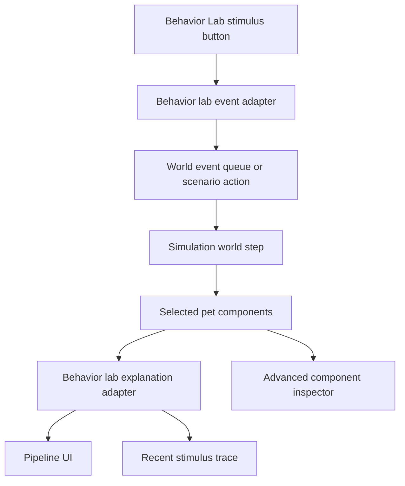

# Interactive Behavior Lab Design

## Goal

Turn the existing Behavior Lab from a mostly passive component inspector into an interactive stimulus lab.

The lab should let a developer inject real world stimuli into the current simulation and immediately see how the selected pet moves through the behavior pipeline:

- stimulus received
- claim or hold created
- decision token selected
- planning result materialized
- presentation state updated

The production simulation remains the source of truth. The handoff `Behavior Lab.html` and `lab-engine.js` provide the user flow and explanatory shape, but they do not replace the current behavior systems.

## Current Context

The project already has the important runtime pieces:

- `WorldEventQueue` and world events for pointer and agent input
- `UserInteractionBehaviorSystem` in the highest behavior priority slot
- `AgentEventBehaviorSystem`, `CollisionBehaviorSystem`, `BehaviorDecisionSystem`, `AutonomousBehaviorSystem`, and `BehaviorPlanningSystem`
- `BehaviorDecisionState`, `HeldAgentState`, `PendingReaction`, and `BehaviorDecisionToken`
- a playground `BehaviorLab` that can inspect selected pet components and copy state to the clipboard

The current lab is useful for debugging, but it requires the developer to infer the pipeline by reading raw components. The handoff prototype is better at teaching the flow: it has clear stimulus buttons, a step-by-step reaction pipeline, and a trace of recent decisions.

## Product Shape

The Behavior Lab becomes a two-column interactive lab inside the existing playground.

The left side focuses on control:

- selected pet identity and current presentation
- stimulus buttons grouped by channel
- basic scenario controls for collision or social setup
- current pet state summary

The right side focuses on explanation:

- a stepper showing the current reaction pipeline
- a readable explanation card for each step
- a recent stimulus trace
- an advanced component inspector that preserves the current raw state view

The lab uses the existing design system. No Daydream tokens, CDN fonts, or prototype CSS are copied into production.

## Stimulus Channels

### Agent Events

The first slice should support these agent events:

- `task.started`
- `task.waiting`
- `attention.requested`
- `task.completed`
- `task.failed`

Each button injects a real agent world event for the selected pet's bound agent source. The existing `AgentEventBehaviorSystem` handles the event, so the lab observes the same behavior the product uses.

### User Interaction

The lab should support user interaction stimuli without pretending to be normal autonomous behavior:

- poke
- pet
- call

The implementation should route these through the same world event and user-interaction path used by playground pointer controls where possible. If a dedicated user-stimulus event is needed, it should be narrow and playground-oriented.

### Collision And Social Setup

The lab should provide at least one collision or social stimulus:

- move another pet near the selected pet
- force an overlap or near-overlap
- step the world until `PendingReaction` appears

This must exercise the real collision and behavior systems. The lab should not compute collision reactions separately.

## Lab Adapter

Add a small lab adapter instead of importing the handoff `lab-engine.js` as a second behavior engine.

The adapter has two jobs:

1. Convert UI stimulus intents into real world events or playground helper actions.
2. Convert selected pet components into an explanation model for the UI.

Suggested modules:

```text
apps/desktop/src/playground/browser/behavior-lab-events.ts
apps/desktop/src/playground/browser/behavior-lab-explanation.ts
```

`behavior-lab-events.ts` owns stimulus creation. It should expose small functions such as:

```ts
createAgentStimulusEvent(...)
createUserStimulusEvent(...)
createCollisionStimulusAction(...)
```

`behavior-lab-explanation.ts` owns the readable pipeline snapshot. It should expose a function shaped like:

```ts
explainBehaviorPipeline({
  pet,
  getComponent,
  lastStimulus,
  now,
})
```

The exact names can change during implementation, but the seam should stay small: the UI asks for a stimulus action or an explanation snapshot, not for raw behavior internals.

## Explanation Model

The explanation model should describe the pipeline in current project terms.

```ts
type BehaviorLabPipelineStep =
  | {
      id: "stimulus";
      status: "idle" | "active" | "complete";
      title: string;
      detail: string;
    }
  | {
      id: "claim";
      status: "idle" | "active" | "complete";
      source?: string;
      reason?: string;
      detail: string;
    }
  | {
      id: "decision";
      status: "idle" | "active" | "complete";
      tokenKind?: string;
      detail: string;
    }
  | {
      id: "planning";
      status: "idle" | "active" | "complete";
      intent?: string;
      motionTarget?: string;
      action?: string;
      detail: string;
    }
  | {
      id: "presentation";
      status: "idle" | "active" | "complete";
      speech?: string;
      detail: string;
    };
```

The UI does not need to show every field at once. The model exists so tests can verify that key runtime states are visible in a stable way.

## UI Behavior

When the user clicks a stimulus button:

1. The lab records the stimulus in local UI state.
2. The playground injects the matching world event or scenario action.
3. The simulation steps normally.
4. The explanation adapter reads the selected pet's current components.
5. The pipeline view highlights the newest meaningful step.
6. The trace records the stimulus, resulting claim source, decision token, and intent.

The existing raw component list remains available under an advanced or debug disclosure. The current copy-to-clipboard action should keep working and should include enough context to debug the last stimulus.

## Data Flow



## Error Handling

If a stimulus cannot be applied, the lab should show a small inline status instead of failing silently.

Examples:

- selected pet has no agent binding for an agent event
- collision setup needs another pet but only one pet exists
- user stimulus is not supported by the selected pet capability

The message should name the missing runtime condition and keep the lab interactive.

## Testing

Add focused tests around the adapter and UI behavior:

- agent stimulus creates the expected world event for the selected pet
- `task.completed` appears in the explanation as an agent claim or held completed state
- `task.failed` appears in the explanation as a failed hold or claim
- collision setup can lead to a pending reaction or collision decision token
- the pipeline explanation shows `BehaviorDecisionToken.kind` when present
- the advanced component inspector and copy-state action still work

Browser-level visual verification should confirm that the lab still fits within the playground layout and that the stimulus groups, pipeline, trace, and advanced inspector do not overlap at common desktop viewport sizes.

## Out Of Scope

- replacing `features/behavior/systems.ts` with `lab-engine.js`
- copying prototype CSS or Daydream design tokens into the app
- extracting all behavior scoring into a separate reusable decision engine
- full replay or time-travel debugging
- production Pet Window controls
- long-term persisted behavior traces

## Recommended Implementation Slice

Start with a narrow but useful slice:

1. Add the event adapter for agent stimuli.
2. Add the explanation adapter for stimulus, claim, decision, planning, and presentation steps.
3. Update `BehaviorLab` to show stimulus buttons, pipeline steps, and recent trace.
4. Preserve the current component inspector behind an advanced disclosure.
5. Add tests for agent event injection and explanation output.
6. Add collision or user-interaction stimuli as the next slice after the agent event flow is stable.

This gives the project an immediately useful lab without introducing a second behavior engine or broad refactoring.
